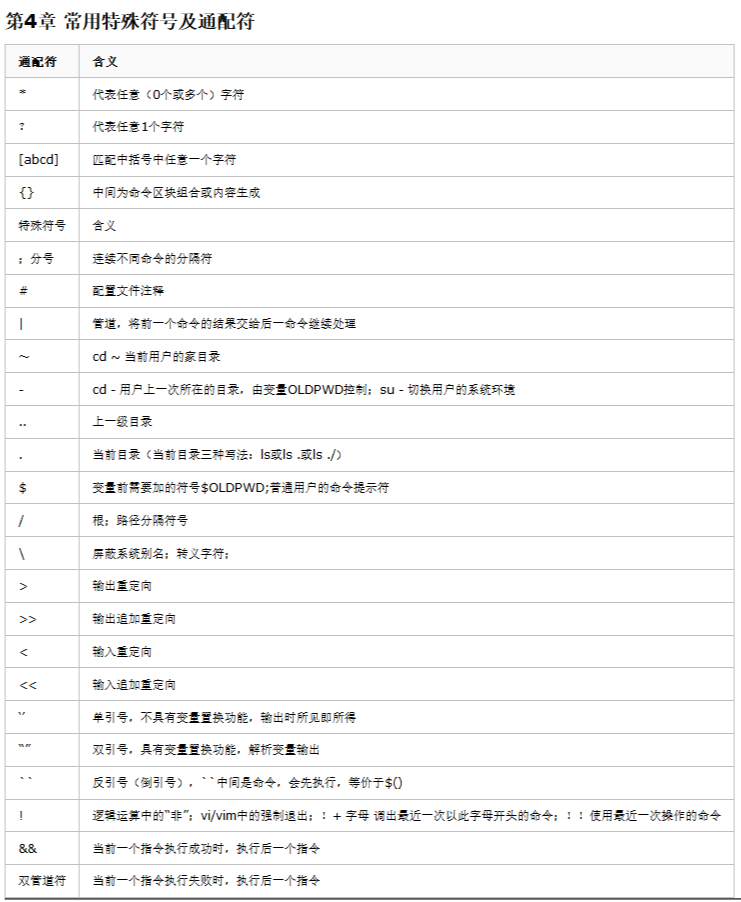

# 09通配符

## 第1章 回顾特殊符号

```bash
|     # 管道符，或者（正则）
>     # 输出重定向
>>    # 输出追加重定向
<     # 输入重定向
<<    # 追加输入重定向
~     # 当前用户家目录
`` $() # 引用命令被执行后的结果
$     # 以。。。结尾（正则）
^     # 以。。。开头（正则）
*     # 匹配任意多个任意字符，通配符
？    # 任意一个字符，通配符
#       # 注释
&       # 让程序或脚本切换到后台执行
&&      # 并且 前后要同时成立
[]      # 表示一个范围（正则，通配符）
{}      # 产生一个序列（通配符），也可以做命令行展开；
.       # 当前目录的硬链接
..      # 上级目录的硬链接
```

## 第2章 通配符

通配符含义===>匹配文件名

```bash
符号                作用
* 	            匹配任何字符串／文本，包括空字符串；*代表任意字符（0个或多个）
? 	            匹配任何一个字符（不在括号内时）?代表任意单个字符
[abcd] 	        匹配abcd中任何一个字符
[a-z] 	        表示范围a到z，表示范围的意思 []匹配中括号中任意一个字符
[!abcd] 	    或[^abcd]表示非，表示不匹配括号里面的任何一个字符
{..} 	        表示生成序列。以逗号分隔，且不能有空格
```

### 2.1 通配符详解

#### 2.1.1 “表示任何字符串”

```bash
ls *.log *.txt
```

#### 2.1.2 ?任意单个字符：

```bash
ls /sbin/???
ls /sbin/??
```

#### 2.1.3 [abcd]表示匹配括号内任意一个字符就成立：

```bash
ls e[abcd]t.txt  => eat.txt,ebt.txt,ect.txt,edt.txt
```

#### 2.1.4 通配符是用来找文件（匹配文件名）

```bash
[root@apache test]# touch {a..z}.txt
[root@apache test]# ls
a.txt  b.txt  c.txt  d.txt  e.txt  f.txt  g.txt  h.txt  i.txt  j.txt  k.txt  l.txt  m.txt  n.txt  o.txt  p.txt  q.txt  r.txt  s.txt  t.txt  u.txt  v.txt  w.txt  x.txt  y.txt  z.txt

[root@apache test]# ls [a-c].txt  # 中括号中不支持..的形式，只能使用-
a.txt  b.txt  c.txt
```

#### 2.1.5 {}生成序列

就是2.1.4的例子；

#### 2.1.6 利用{}来备份

```bash
[root@apache test]# cp a.txt{,.bak}  # 备份文件；
[root@apache test]# ls a.*
a.txt  a.txt.bak

[root@apache test]# cp a.{txt,note}  # 复制并修改文件后缀名
[root@apache test]# ls a.*
a.note  a.txt  a.txt.bak
```

#### 2.1.7 [^abcd] !^ 表示非，取反

```bash
[root@apache test]# ls [^abcd].txt
e.txt  f.txt  g.txt  h.txt  i.txt  j.txt  k.txt  l.txt  m.txt  n.txt  o.txt  p.txt  q.txt  r.txt  s.txt  t.txt  u.txt  v.txt  w.txt  x.txt  y.txt  z.txt
[root@apache test]# ls [!abcd].txt
e.txt  f.txt  g.txt  h.txt  i.txt  j.txt  k.txt  l.txt  m.txt  n.txt  o.txt  p.txt  q.txt  r.txt  s.txt  t.txt  u.txt  v.txt  w.txt  x.txt  y.txt  z.txt
```

### 2.2 []与{}区别

- []只能用来找文件
- {} 用来找文件，或创造文件，生成序列

```bash
[root@apache test]# touch {a..z}   # 生成序列；
[root@apache test]# ls
a  b  c  d  e  f  g  h  i  j  k  l  m  n  o  p  q  r  s  t  u  v  w  x  y  z
[root@apache test]# mv a{,ab}      # 多项式展开，将文件a重命名为ab
[root@apache test]# ls {a,b,d}
ls: cannot access a: No such file or directory
b  d
```

### 2.3 通配符小结

通配符含义===>匹配文件名

```bash
符号 	            作用 	
* 	               匹配任何字符串／文本，包括空字符串；代表任意字符（0个或多个） ls file 	
? 	                匹配任何一个字符（不在括号内时）?代表人意1个字符 ls file 0 	
[abcd] 	            匹配abcd中任何一个字符 	
[a-z] 	            表示范围a到z，表示范围的意思 []匹配中括号中任意一个字符 ls file 0 	
{..} 	            表示生成序列。以逗号分隔，且不能有空格 		
[!abcd] 	        或[^abcd]表示非，表示不匹配括号里面的任何一个字符
```

## 第3章 特殊符号
### 3.1 管道部分

```bash
 命令1|命令2  ###管道符号，传递的时普通的文本，字符串，来自于前一个命令。
 |xargs      ###管道符号，与xargs传递的是把文本，字符串变成了文件名
```

### 3.2 目录结构

```bash
.   #当前目录（或“任意一个字符”正则）
..  #当前目录的上一级目录
```

### 3.3 重定向符号

```bash
>   #输出重定向，会清空原文内容，然后再向文件里面追加内容
>>  #追加输出重定向，追加到文件的最后一行
<   #输入重定向tr xargs
<<  # 结合cat 用来给文件追加多行文本

例如： > /dev/null 2>&1  将 标准错误输出 重定向到 标准输出；
```

```bash
[root@apache test]# cat > aab << EOF
> hello,
> how are you?
> hello again,
> how old are you?
> EOF
[root@apache test]# cat aab 
hello,
how are you?
hello again,
how old are you?
```

### 3.4未分类特殊符号

#### 3.4.1 #表示注释

linux 会忽略他，给运维人员看的，解释说明用的。

#### 3.4.2 $ 引用变量 取变量的值或普通用户的命令提示符

1、shell

    $变量 ===>取变量里面的内容

2、awk

    $取列 $数字

3、普通用户的命令提示符

    [root@chensiqi ~]$

#### 3.4.3 反引号``(esc下面),引用命令的结果，相当于$()

```bash
[root@apache test]# which cat
/usr/bin/cat
[root@apache test]# ls -lh $(which cat)
-rwxr-xr-x. 1 root root 53K Apr 11  2018 /usr/bin/cat
[root@apache test]# ls -lh `which cat`
-rwxr-xr-x. 1 root root 53K Apr 11  2018 /usr/bin/cat
[root@apache test]# ls -lh /bin/cat
-rwxr-xr-x. 1 root root 53K Apr 11  2018 /bin/cat
```

#### 3.4.4 分号；分隔多个命令，没有逻辑关系，只是一步一步执行。

1、shell

    pwd;pwd;pwd;hostname
    相当于
    pwd
    pwd
    pwd
    hostname

2、sed

    [root@chensiqi ~]$ seq 100 | sed -n '20p;50p;100p'
    20
    50
    100

#### 3.4.5 减号- (cd - ;su -)

```bash
    cd - ###返回上一次的工作目录，返回上一次的位置
    su - ###切换用户，重新加载环境变量
```

#### 3.4.6 ～ 当前用户的家目录，老家

```bash
[root@chensiqi ~]$ cd ~  # 会直接返回当前用户的家目录
```

#### 3.4.7 / 根或者路径分隔符
#### 3.4.8  转义符号或者叫屏蔽别名

```bash
.    #(正则里代表任意一个字符)
\.   #只代表一个点的符号
```

#### 3.4.9 ！ 表示非

1、表示非

```bash
[root@apache test]# mkdir xiong
[root@apache test]# touch xiong/{a..f}
[root@apache test]# ls xiong/
a  b  c  d  e  f
[root@apache test]# touch xiong/xiongba
[root@apache test]# find xiong/ -type f ! -name "xiongba"   # 文件名不为xiongba
xiong/a
xiong/b
xiong/c
xiong/d
xiong/e
xiong/f
```

2、表示强制

    vi/vim中 强制退出 （q！）

#### 3.4.10 && 表示并且

```bash
[root@apache test]# head -2 aab && tail -2 aab 
hello,
how are you?
hello again,
how old are you?
[root@apache test]# head -1 aab && tail -1 aab 
hello,
how old are you?
[root@apache test]# # 最常用的make && make install
```

`&&符号只有当前边的命令执行成功才会执行后边的命令`

## 第四章 常用特殊符号及通配符




## 第5章 单引号，双引号，不加引号的区别

```bash
[root@apache test]# echo '$LANG $(which mkdir) {a..z}'  # 单引号，引号里内容即所得；
$LANG $(which mkdir) {a..z}
[root@apache test]# echo "$LANG $(which mkdir) {a..z}"  # 双引号，解析特殊符号，但是没有解析通配符；
en_US.UTF-8 /usr/bin/mkdir {a..z}
[root@apache test]# echo $LANG $(which mkdir) {a..z}
en_US.UTF-8 /usr/bin/mkdir a b c d e f g h i j k l m n o p q r s t u v w x y z
# 不加引号，特殊符号，通配符全部解析；
```

* 单引号：所见即所得。
* 双引号：解析特殊符号，特殊符号有了原本的特殊意思
* 不加引号：比较特殊，支持通配符
