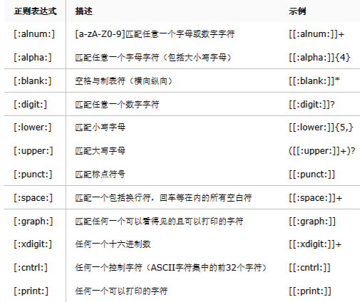
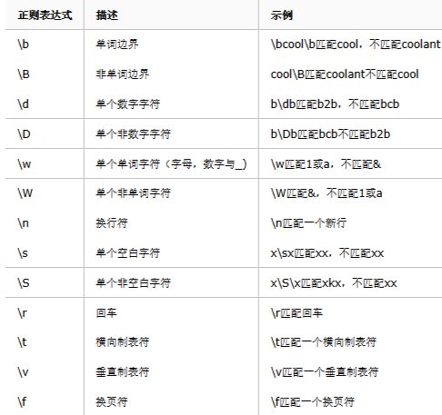

# 10正则表达式

## 第1章 什么是正则表达式

    正则表达式就是为了处理大量的文本|字符串而定义的一套规则和方法
    通过定义的这些特殊符号的辅助，系统管理员就可以快速过滤，替换或输出需要的字符串。Linux正则表达式一般以 行 为单位处理。

简单说

    为处理大量文本|字符串而定义的一套规则和方法
    以 行 为单位出来，一次处理一行

    正则表达式是一种描述一组字符串的模式，类似数字表达式，通过各种操作符组成更小的表达式

## 第2章 为何使用正则表达式

    linux运维工作，大量过滤日志工作，化繁为简。
    简单，高效。
    正则表达式高级工具；三剑客都支持

## 第3章 容易混淆的两个注意事项

    正则表达式应用非常广泛，存在于各种语言中，php perl grep sed awk 支持。
    但现在学的是Linux中的正则表达式，最常应用正则表达式的命令是grep（egrep），sed，awk。
    正则表达式和通配符有本质区别

    正则表达式用来找：【文件】内容，文本，字符串。一般只有三剑客支持
    通配符用来找：文件名，普通命令都支持

## 第4章 正则表达式使用注意事项

1.linux正则表达式以行为单位处理字符串

2.便于区别过滤出来的字符串，一定配合grep／egrep命令学习。

```bash
[root@apache test]# alias 
alias cp='cp -i'
# 检查这三个别名是否存在，若系统中不存在，自行添加；
alias egrep='egrep --color=auto'
alias fgrep='fgrep --color=auto'
alias grep='grep --color=auto'

alias l.='ls -d .* --color=auto'
alias ll='ls -l --color=auto'
alias ls='ls --color=auto'
alias mv='mv -i'
alias rm='rm -i'
alias which='alias | /usr/bin/which --tty-only --read-alias --show-dot --show-tilde'
```

3.注意字符集，export LC_ALL=C, 无论何时，做任何事都要注意字符集；

```bash
# 有少数特殊情况下，会出现正则失效的可能，多数情况下和字符集有关，加入以下这行配置即可；
[root@apache test]# echo "export LC_ALL=C" >> /etc/profile
[root@apache test]# tail -1 /etc/profile
export LC_ALL=C
[root@apache test]# source /etc/profile
[root@apache test]# echo $LANG
en_US.UTF-8
```

## 第5章 正则表达式的分类

POSIX规范将正则表达式的分为了两种：

* 基本正则表达式（BRE，basic regular expression）
* 高级功能：扩展正则表达式（ERE，extended regular expression）

### 5.1 BRE和ERE的区别仅仅是元字符的不同：

* BRE（基础正则表达式）只承认的元字符有^$.[]*其他字符识别为普通字符：\(\)
* ERE(扩展正则表达式）则添加了（）{}?+|等
* 只有在用反斜杠“”进行转义的情况下，字符（）{}才会在BRE被当作元字符处理，而ERE中，任何元符号前面加上反斜杠反而会使其被当作普通字符来处理。

## 第6章 如何区分通配符和正则表达式

* 不需要思考的判断方法：在三剑客awk，sed，grep，egrep都是正则，其他都是通配符
* 区别通配符和正则表达式最简单的方法：
  - （1）文件目录名===>通配符
  - （2）文件内容（字符串，文本【文件】内容）===>正则表达式
* 通配符和正则表达式都有“*”，“?”，“[]”，但是通配符的这些符号都能自身代表任意字符，而正则表达式的这些符号只能代表这些符号前面的字符

## 第7章 基本正则表达式

### 7.1 基础正则表达式：

字符 | 描述
----|----
| ^ | ^word搜索以word开头的内容；|
| $ | word$搜索以word结尾的内容；|
| ^$| 表示空行，不是空格；|
| . | 代表且只能代表任意一个字符(不匹配空行)；|
| \ | 转义字符，让有特殊含义的字符脱掉马甲，现出原形，如\.只表示小数点；|
| * | 重复之前的字符或文本0此或多次；|
| .*| 任意多个任意字符；|
| ^.* | 以任意多个字符串开头，.*尽可能多，有多少算多少，贪婪性；|
| 括号表达式：[abc][0-9][\\.,/] | 匹配字符集合内的任意一个字符a或b或c： [a-z]匹配所有小写字母；表示一个整体，内藏无限可能； [abc]==[a-c] |
| [^abc]  | 匹配不包含^后的任意字符，是对[abc]的取反，且与^含义不同；|
| a\\{n,m\\} |  重复前面a字符n到m次(如果用egrep或sed -r可去掉反斜杠) |
| a\\{n,\\}  |  重复前面a字符至少n次，如果使用egrep或sed -r可去掉斜线；|
| a\\{n\\}   |  重复前面a字符n次，如果使用egrep或sed -r可去掉斜线；|
| a\\{,m\\}  | 最多m次；|


## 第8章 扩展正则表达式ERE

|特殊字符 | 含义与例子|
|--------|----------|
| + | 重复前一个字符一次或一次以上，前一个字符连续一个或多个，把连续的文本 / 字符取出；|

```bash
[root@apache test]# grep "^[abcdh]" aab   # 查找以[]括号里任意字符开头的行；
hello,
how are you?
hello again,
how old are you?
[root@apache test]# grep "^[abcdh]+" aab   # 查找以[]括号中任意字符开头并且重复1次或多次的行，但是grep默认不支持正则表达式；
[root@apache test]# grep "^[abcdh]\+" aab    # 加了转义字符就认识正则符号了；
hello,
how are you?
hello again,
how old are you?
[root@apache test]# grep -E "^[abcdh]+" aab    # grep -E 让grep支持正则表达式，和egrep等效；
hello,
how are you?
hello again,
how old are you?
[root@apache test]# egrep "^[abcdh]+" aab      # egrep
hello,
how are you?
hello again,
how old are you?
```

|特殊字符 | 含义与例子|
|--------|----------|
| ？ | 重复前面一个字符0次或1次(.是有且只有1个)|

```bash
[root@apache test]# grep -n "^[abcdh]\?" aab   # ?号，匹配前面的字符0次或者1次，如果匹配0次，就默认为空，也就等于全匹配了；
1:hello,
2:how are you?
3:hello again,
4:how old are you?
```

|特殊字符 | 含义与例子|
|--------|----------|
| 管道符 \| | 表示或者多事同时过滤多个字符|

```bash
[root@apache test]# ss -tnl | grep "22\|25"
LISTEN     0      128          *:22                       *:*                  
LISTEN     0      100    127.0.0.1:25                       *:*                  
LISTEN     0      128         :::22                      :::*                  
LISTEN     0      100        ::1:25                      :::*  
[root@apache test]# ss -tnl | grep -E "22|25"                
[root@apache test]# ss -tnl | egrep "22|25"
```

|特殊字符 | 含义与例子|
|--------|----------|
| () | 分组过滤被括起来的东西表示一个整体（一个字符），后向引用 | 

```bash
dumpe2fs /dev/sda3 | grep -E "Inode size|Inode count"
dumpe2fs /dev/sda3 | grep -E "Block size|Block count"
dumpe2fs /dev/sda3 | grep -E "Inode (size|count)"
dumpe2fs /dev/sda3 | grep -E "Inode (size|count)|Block(size|count)"
```

## 第9章 正则小结

* 基础正则：BRE

字符| 含义
|---|---|
|^|  以指定字符开头|
|$|  以指定字符结尾|
|.|  任意单个字符|
|[abc]| 指定范围内的单个字符|
|[^abc]| 指定范围以外的任意单个字符|

* 扩展正则：ERE

字符 | 含义
|---|---|
| +  | 表示次数，匹配前面字符至少1次；
| \| | 表示或者，匹配多个|
| ?  | 表示次数，0次或1次；|
| () | 分组过滤，方便后续引用|
| {} | 表示次数的组合，看后面的；|
| a{n,m}  | 匹配a字符至少n次，至多m次；|
| a{n,}   | 匹配a字符至少n次，|
| a{n}|   | 匹配a字符n次；|

* 转义字符\: 将字符的意思改变（不支持正则符号的，转变字符含义为正则，支持正则的转变为普通字符含义）

### 注意：

* grep默认不支持正则，因此正则表达式的符号对于grep来说就等同于普通字符含义，因此，想让grep直接处理正则符号必须通过转义字符\{\}来处理。
* grep -E 强制让grep直接认识正则符号，不需要再进行转义
* egrep 等效grep -E 天生就能认识正则符号
* 我们平时备份可以通过cp 文件名{,.bak}的形式进行，避免再打一次文件名，多项式展开；

    sed -r ：让sed支持正则

## 第10章 基本正则和扩展正则区别

基础正则BRE  |	扩展正则ERE
|-----------|-------------|
| \\? 	| ?  |
| \\+ 	| +  |
| \\{\\}| {} |
| \\(\\)| () |
|\ 	    |    |

所谓基础正则实际上就是得需要转义字符配合表达的正则，而扩展正则就是让命令扩展它的权限让他直接就认识正则表达符号（egrep，sed -r，awk直接支持）

## 第11章 补充说明

### 11.1 一些预定义的：



### 11.2 元字符

元字符是一种Perl风格的正则表达式，只有一部分文本处理工具支持它，并不是所有的文本处理工具都支持




## 第12章 正则表达式总结

* egrep／grep 了解一下正则，简单看看效果，结果
* egrep／grep -o 参数看正则到底匹配了什么
* 多练就好，配合grep，egrep，sed -r，awk更为强大

## 第13章 参考资料

[正则表达式30分钟入门教程](http://deerchao.net/tutorials/regex/regex.htm#mission)
