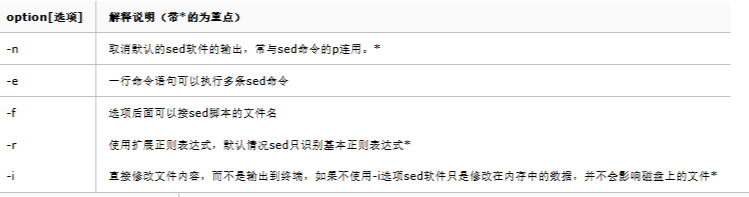

# 12linux三剑客之sed

## 1、前言

* 我们都知道，在Linux中一切皆文件，比如配置文件，日志文件，启动文件等等。如果我们相对这些文件进行一些编辑查询等操作时，我们可能会想到一些vi,vim,cat,more等命令。但是这些命令效率不高，这就好比一块空地准备搭建房子，请了10个师傅拿着铁锹挖地基，花了一个月的时间才挖完，而另外一块空地则请了个挖土机，三下五除二就搞定了，这就是效率。而在linux中的“挖土机”有三种型号：顶配awk，中配sed，标配grep。使用这些工具，我们能够在达到同样效果的前提下节省大量的重复性工作，提高效率。

接下来我们就看一下sed的详细说明：

* sed 是Stream Editor（字符流编辑器）的缩写，简称流编辑器。什么是流？大家可以想象一下流水线，sed就像一个车间一样，文件中的每行字符都是原料，运到sed车间，然后经过一系列的加工处理，最后从流水线下来就变成货物了。


* 当然上图中的文件内容可以是来自文件，也可以直接来自键盘或者管道等标准输入，最后的结果默认情况下是显示到终端的屏幕上，但是也可以输出到文件中。

* 以前工厂中没有流水线时，生产一件商品需要十几个工种互相配合，这样下来利润太低，后来就有了流水线，生产一件商品虽然还是有十几道工序，但都是机器化生产，工人只是辅助作用，这样利润就大大提高了，产量也大大提高了。

* 编辑文件也是这样，以前我们修改一个配置文件，需要移动光标到某一行，然后添加点文字，然后又移动光标到另一行，注释点东西.......可能修改一个配置文件下来需要花费数十分钟，还有可能改错了配置文件，又得返工。这还是一个配置文件，如果数十个数百个呢？因此当你学会了sed命令，你会发现利用它处理文件中的一系列修改是很有用的。只要想到在大约100多个文件中，处理20个不同的编辑操作可以在几分钟之内完成，你就会知道sed的强大了。

## 2、软件功能与版本

* Sed命令是操作，过滤和转换文本内容的强大工具。常用功能有增删改查（增加，删除，修改，查询），其中查询的功能中最常用的2大功能是过滤（过滤指定字符串），取行（取出指定行）。

```bash
[root@apache test]# cat /etc/redhat-release   # 操作系统发行版
CentOS Linux release 7.5.1804 (Core) 
[root@apache test]# uname  -r      # 内核版本
3.10.0-862.el7.x86_64
[root@apache test]# sed --version  # 查看sed版本；
sed (GNU sed) 4.2.2
Copyright (C) 2012 Free Software Foundation, Inc.
License GPLv3+: GNU GPL version 3 or later <http://gnu.org/licenses/gpl.html>.
This is free software: you are free to change and redistribute it.
There is NO WARRANTY, to the extent permitted by law.

Written by Jay Fenlason, Tom Lord, Ken Pizzini,
and Paolo Bonzini.
GNU sed home page: <http://www.gnu.org/software/sed/>.
General help using GNU software: <http://www.gnu.org/gethelp/>.
E-mail bug reports to: <bug-sed@gnu.org>.
Be sure to include the word ``sed'' somewhere in the ``Subject:'' field.
```

## 3、语法格式

```bash
sed [options] [sed -commands] [input -file]
sed [选项]  【sed命令】 【输入文件】
```

说明：

* 1.注意sed软件以及后面选项，sed命令和输入文件，每个元素之间都至少有一个空格。
* 2.为了避免混淆，本文称呼sed为sed软件。sed -commands(sed命令)是sed软件内置的一些命令选项，为了和前面的options（选项）区分，故称为sed命令
* 3.sed -commands 既可以是单个sed命令，也可以是多个sed命令组合。
* 4.input -file (输入文件)是可选项，sed还能够从标准输入如管道获取输入。

## 4、命令执行流程

### 概括流程：

    Sed软件从文件或管道中读取一行，处理一行，输出一行；再读取一行，再处理一行，再输出一行....

### 小知识：

    一次一行的设计使得sed软件性能很高，sed在读取非常庞大的文件时不会出现卡顿的想象。大家都用过vi命令，用vi命令打开几十M或更大的文件，会发现有卡顿现象，这是因为vi命令打开文件是一次性将文件加载到内存，然后再打开，因此卡顿的时间长短就取决于从磁盘到内存的读取速度了。而且如果文件过大的话还会造成内存溢出现象。Sed软件就很好的避免了这种情况，打开速度非常快，执行速度也很快。

### 详细流程：

    现有一个文件person.txt,共有五行文本，sed命令读入文件person.txt的第一行“101，chensiqi,CEO”,并将这行文本存入模式空间（sed软件在内存中的一个临时缓存，用于存放读取到的内容，比喻为工厂流水线的传送带。）

### 文件person.txt在模式空间的完整处理流程

    1.判断第1行是否是需要处理的行，如果不是要处理的行就重新从文件读取下一行，如果是要处理的行，则接着往下走。
    2.对模式空间的内容执行sed命令，比如a（追加），i（插入），s（替换）...
    3.将模式空间中经过sed命令处理后的内容输出到屏幕上，然后清空模式空间
    4.读取下一行文本，然后重新执行上面的流程，直到文件结束


### Sed软件有两个内置的存储空间：

* 模式空间（pattern space）：是sed软件从文本读取一行文本然后存入的缓冲区（这个缓冲区是在内存中的），然后使用sed命令操作模式空间的内容。
    
* 保持空间（hold space）：是sed软件另外一个缓冲区，用来存放临时数据，也是在内存中，但是模式空间和保持空间的用途是不一样的。Sed可以交换保持空间和模式空间的数据，但是不能在保持空间上执行普通的sed命令，也就是说我们可以在保持空间存储数据。

## 5、选项说明




## 6、使用范例

### 6.1 统一实验文本

```bash
[root@apache test]# cat person.txt 
101,chensiqi,CEO
102,zhangyang,CTO
103,Alex,COO
104,yy,CFO
105,feixue,CIO
```

### 6.2 常用功能-增删改查

#### 6.2.1 增

* 第一式招法-->往文件指定位置追加或插入指定文本。

    这个功能非常有用，比如我们平时往配置文件写入几行文本，最常用的是vi或vim命令，但是这2个命令是一种交互式的命令，还需要我们在vi/vim编辑器界面输入字符串然后保存退出，操作有些繁琐但是还能用。但是当我们学会了Shell脚本后，我们就会发现在脚本中不能正常使用vi或vim命令，为什么呢？同学们请自行体验。

    我们学习Shell脚本主要是为了解放我们的双手，执行一个脚本，然后自动往文件中写入数据，不需要我们再动手。因此我们想到了sed软件，它能够帮助我们实现目的。

* 这里我们需要用到2个sed命令，分别是：

    “a”:追加文本到指定行后，记忆方法：a的全拼是apend，意思是追加。

    “i“：插入文本到指定行前，记忆方法：i的全拼是insert，意思是插入。

* 6.2.1.1 单行增

    单行增加的用法: 说白了就是在文件中增加一行文本，我们以前学过echo命令可以在文件的末尾追加文本，比较简单，但是我们还有其他的复杂需求，比如在第10行插入一行数字等等，这里就需要sed出马了。

```bash
[root@apache test]# sed '2a 106,dandan,CSO' person.txt  # 在2行之后append；
101,chensiqi,CEO
102,zhangyang,CTO
106,dandan,CSO   # 新增行
103,Alex,COO
104,yy,CFO
105,feixue,CIO
```

sed语句的结构：

    sed打头，然后接上空格（空格个数不限，但至少要有一个！）在空格后面，我们先敲上一对单引号（“）然后退格在单引号中协商‘106，dandan，CSO’。

    2代表指定对第2行操作，其他的行忽略
    i代表插入的意思，2i即在第2行前插入文本
    2i后面加上空格，然后跟上你想要插入的文本即可

```bash
[root@apache test]# sed '2i 106,dandan,CSO' person.txt 
101,chensiqi,CEO
106,dandan,CSO
102,zhangyang,CTO
103,Alex,COO
104,yy,CFO
105,feixue,CIO
```

* 6.2.1.2 引号的区别总结

在sed中到底使用单引号还是双引号？引号的区别:

- 双引号：把双引号的内容输出出来；如果内容中有命令，变量等，会先把命令，变量解析出结果，然后再输出最终内容来。双引号内命令或变量的写法为`命令或变量`或$(命令或变量)
* 单引号：所见即所得，将单引号内的内容原样输出，阻止所有字符的转义
* 不加引号：不会将含有空格的字符串视为一个整体输出，如果内容中有命令，变量等，会先把命令，变量解析出结果，然后再输出最终内容来，如果字符串含有空格等特殊字符，则不能完整输出，则需改加双引号。
* 倒引号（反引号Esc键下方）：进行命令的替换，在倒引号内部的shell命令将会被执行，其结果输出代替用倒引号括起来的文本。

Sed为何用单引号？

```bash
[root@apache test]# cat person.txt 
101,chensiqi,CEO
102,zhangyang,CTO
103,Alex,COO
104,yy,CFO
105,feixue,CIO
[root@apache test]# sed '2i $PATH' person.txt  # 单引号-文本内容原封不动插入；
101,chensiqi,CEO
$PATH
102,zhangyang,CTO
103,Alex,COO
104,yy,CFO
105,feixue,CIO
[root@apache test]# sed 2i $PATH person.txt    # 不加引号，linux无法辨认空格，不会把有空格的命令当成一条命令来执行；
sed: -e expression #1, char 2: expected \ after `a', `c' or `i'
[root@apache test]# sed "2i $PATH" person.txt  # 双引号-变量$PATH被解析以后再当做文本进行插入；
101,chensiqi,CEO
/usr/local/apache/bin:/usr/local/apache/bin:/usr/local/sbin:/usr/local/bin:/usr/sbin:/usr/bin:/root/bin:/usr/local/lnmp/mysql/bin/
102,zhangyang,CTO
103,Alex,COO
104,yy,CFO
105,feixue,CIO
```

#### 结论一：
* 如果引号里面是普通字符串的话，你可以任意使用单引号或者双引号：
* 如果引号里面是变量或者带反引号的命令的话，你想要变量解析的结果或者命令执行的结果，那就使用双引号；你想要引号内的原样字符串，那就使用单引号。
* 只要大家理解上面的用法，明白自己想要什么，那么你想用什么引号就用什么引号。
* 其实就二选一，非此即彼，这个不行就试试那个。

#### 结论二：

* 很多时候，总结的结论未必适合所有情况。但是，总结小结论，便于我们学习知识和对知识的深刻理解，因此推荐大家多做总结。
* 不要太纠结于结论，结论毕竟不是真理，只是我们学习过程的产物。就像数学里的平行线一样，在初中定义就是不相交的两条直线就是平行线，到了高中结论就是错的了。

#### 6.2.1.3 多行增

示例准备，请执行如下完整命令生成test.txt文件内容：

```bash
[root@apache test]# cat > test.txt <<EOF
> welcome to my blog.http://www.sslinux.com/kalaguiyin/
> 
> if you like my blog\'s contents,pls support me.
> 
> 
> 
> bye!boys and girls.
> EOF
```

命令说明：以上就是cat的生产环境常用的生成或为文件追加内容的方法，请不要忽略上文中的空行。另外，如果内容中有单引号，$符号等特殊符号作为内容时要用“\”转义。

cat命令和echo命令有同样的缺点，只能是往文末添加内容，并不能够在指定行操作，因此还是需要我们的sed命令出马。

首先我们需要了解一个特殊符号“\n”，这个符号叫做换行符，顾名思义换行。

```bash
[root@apache test]# echo "kalaguiyin";echo "kalaguiyin"
kalaguiyin
kalaguiyin
# 命令说明：上面的命令用分号“；”连接了两条命令，然后输出结果为2行kalaguiyin，但是有没有更简单的方法呢？
[root@apache test]# echo -e "kalaguiyin\nkalaguiyin"
kalaguiyin
kalaguiyin
# 命令说明：这里就“\n”派上用场了，行与行之间是以“\n”作为分隔符的，所以“kalaguiyin\kalaguiyin”就等效于2行kalaguiyin。
# 接下来我们用echo命令实验一下，其中-e参数表示字符串中如果出现以下特殊字符（\n代表换行，\t代表Tab键等），则加以特殊处理，而不会将它当成一般文字输出。
```

* sed增加多行：

```bash
[root@apache test]# sed '2a 106,dandan,CSO\n107,bingbing,CCO' person.txt 
101,chensiqi,CEO
102,zhangyang,CTO
106,dandan,CSO
107,bingbing,CCO
103,Alex,COO
104,yy,CFO
105,feixue,CIO
```

另外一种方法添加多行文本，但这种方法并没有“\n”方便，所以在这里就简单说一下。这种方法利用了“\”，它也有换行的意思。如果大家在执行一行很长的命令时候，如果都写在一行，那太难看了也难以理解，因此就利用到了这个符号可以将一条完整的命令分成多行.

* sed命令使用反斜线，首先输入完“sed '2a 106,dandan,CSO ”,然后敲回车键，这样窗口会显示一个符号“>”,我们在这个符号后面接着写命令的剩余部分“107，bingbing，CCO‘ person.txt”。

```bash
# 不建议使用
[root@apache test]# sed '2a 106,dandan,CSO \
107,bingbing,CCO' \
> person.txt 
101,chensiqi,CEO
102,zhangyang,CTO
106,dandan,CSO 
107,bingbing,CCO
103,Alex,COO
104,yy,CFO
105,feixue,CIO
```

* sed软件使用命令i插入多行文本和命令和a的用法是一样的；

* 企业案例1:优化SSH配置（一键完成增加若干参数）

    在我们学习CentOS6系统优化时，有一个优化点：更改ssh服务远程登录的配置。主要的操作是在ssh的配置文件/etc/ssh/sshd_config加入下面5行文本。

```bash
Port 52113
PermitRootLogin no
PermitEmptyPasswords no
UseDNS no
GSSAPIAuthentication no
```

现在想用一条命令增加5行文本到第13行前？

    注意：修改前别忘了备份配置文件：cp /etc/ssh/sshd_config{,.bak}

```bash
[root@apache test]# cp /etc/ssh/sshd_config{,.bak}
[root@apache test]# sed -i '13i Port 52113\nPermitRootLogin no\nPermitEmptyPasswords no\nUseDNS no\nGSSAPIAuthentication no' /etc/ssh/sshd_config.bak 
[root@apache test]# sed -n '13,17p' /etc/ssh/sshd_config.bak
Port 52113
PermitRootLogin no
PermitEmptyPasswords no
UseDNS no
GSSAPIAuthentication no
```
选项"-i",能够实际的修改文件内容,在生产环境修改配置文件那就需要用-i选项了。

#### 6.2.2 删

删除指定行文本。

这个功能也是非常得有用，比如我们想删除文件中的某些行，以前最常用的是vi或vim命令，但现在我们知道了sed命令，就应该使用这个高逼格的命令完成任务了。

这里我们需要用到1个sed命令；

    “d”:删除文本，记忆方法：d的全拼是delete，意思是删除。
    因为删除功能比较简单，因此我们结合地址范围一起说明。
    我们前面学过sed命令可以对一行文本为目标进行处理（在单行前后增加一行或多行文本），接下来我们看一下如何对多行文本为目标操作。

* 6.2.2.1指定执行的地址范围

sed软件可以对单行或多行文本进行处理。如果在sed命令前面不指定地址范围，那么默认会匹配所有行。

  - 用法：n1[,n2]{sed -commands}

    地址用逗号分隔开，n1,n2可以用数字，正则表达式，或者二者的组合表示。


测试举例：(数字地址范围)

```bash
[root@apache test]# sed 'd' person.txt 
[root@apache test]# 
# 命令说明：如果在sed命令前面不指定地址范围，那么默认会匹配所有行，
# 然后使用d命令删除功能就会删除这个文件的所有内容

[root@apache test]# sed '2d' person.txt  # 删除第2行；
101,chensiqi,CEO
103,Alex,COO
104,yy,CFO
105,feixue,CIO

[root@apache test]# sed '2,5d' person.txt # 删除第2行到第5行的内容；
101,chensiqi,CEO
```

测试举例：（正则表达式的地址范围，虽然说可以使用正则表达式，但是我们还是习惯写出完整的匹配字符串，达到精确匹配的目的。）

```bash
[root@apache test]# sed '/zhangyang/d' person.txt 
101,chensiqi,CEO
103,Alex,COO
104,yy,CFO
105,feixue,CIO
# 在sed中，使用正则表达式和awk一样，使用2个"/"包含指定的正则表达式，即"/正则表达式/".
```

使用两个正则表达式:

```bash
# 这是正则表达式形式的多行删除，也是以逗号分隔2个地址，
# 最后结果是删除包含“chensiqi”的行 到 包含“Alex”的行
[root@apache test]# sed '/chensiqi/,/Alex/d' person.txt 
104,yy,CFO
105,feixue,CIO

# 匹配不上的情况：
1.前面匹配，后面不匹配： 会删除匹配/chensiqi/行，到最后一行的内容；
2.只要前面不匹配，就不会执行操作；
```

```bash
[root@apache test]# sed '3,$d' person.txt 
101,chensiqi,CEO
102,zhangyang,CTO
# $在sed中代表文件的最后一行。因此删除第3行到最后一行的文本，包含第3行和最后一行
```

测试举例：(特殊情况)

```bash
[root@apache test]# sed '/chensiqi/,3d' person.txt 
104,yy,CFO
105,feixue,CIO
# 删除包含“chensiqi”的行到第3行的内容。
# 但这种组合有一个比较特殊的情况，如果前3行之外还有这个“chensiqi”字眼，sed软件还是会找他“麻烦”

[root@apache test]# sed '$a 106,chensiqi,CMO' person.txt | sed '/chensiqi/,3d'
104,yy,CFO
105,feixue,CIO
# 不仅是第1行（101，chensiqi，CEO）到第3行（103，ALex，COO）被删除了，
# 而且最后一行（106，chensiqi，CMO）也被删除了。
# 因此我们可以得出一个小结论，sed软件使用正则表达式会找出所有匹配的行，即使是有数字地址限制。
```

```bash
[root@apache test]# sed '2,/O/d' person.txt 
101,chensiqi,CEO
104,yy,CFO
105,feixue,CIO
# 命令说明：
# 从第2行开始删除到含字母O的行结束，但是我们发现第3，4，5行都含有字母O，命令结果显示只删除了第2，3行，属于最短删除。这个怎么理解？
# 从第2行开始循环，sed软件第一次遇到字母O（第三行）就认为循环结束了。

[root@apache test]# sed '2,/o/d' person.txt 
101,chensiqi,CEO
#从第2行开始删除，但是后面文本没有字母O，因此一直循环下去，直到文本结束，sed软件自动终止。
```

* 6.2.2.2 特殊符号～（步长）解析

    格式：“First～step”表示从First开始，以步长step递增，这个在数学中叫做等差数列

例子：

    1～2 匹配1，3，5，7.....#-->用于只输出奇书行，大伙仔细观察一下每个数字的差值。
    2～2 匹配2，4，6，8....#-->用于只输出偶数行
    1～3 匹配1，4，7，10.....
    2～3 匹配2，5，8，11.....

```bash
# seq [OPTION]... FIRST INCREMENT LAST
[root@apache test]# seq 10  # seq命令生成从1到指定数字的数字序列；
1
2
3
4
5
6
7
8
9
10
[root@apache test]# seq 10 | sed -n '1~2p'
1
3
5
7
9
```

* 6.2.2.3 特殊符号+解析

```bash
# 这其实是做个加法运算，‘1，+2d’==>删除第1行到第3（1+2）行的文本。
[root@apache test]# sed '1,+2d' person.txt  
104,yy,CFO
105,feixue,CIO
```

* 6.2.2.4 特殊符号！解析

    感叹号“！”我们在很多命令里都接触过，大部分都是取反的意思，在sed中也不例外。

```bash
[root@apache test]# sed '2,3!d' person.txt 
102,zhangyang,CTO
103,Alex,COO
# 命令说明：在地址范围“2，3”后面加上“!”，只保留2,3行，其他的行全部删除；
```

* 企业案例2:打印文件内容但不包含chensiqi

    这是一道企业面试题，很简单，就是把包含chensiqi字符串的行删除掉即可。我们可以用“grep -v”取反得到我们想要的结果，但是这里我们使用sed软件实现。

```bash
[root@apache test]# grep -v chensiqi person.txt 
102,zhangyang,CTO
103,Alex,COO
104,yy,CFO
105,feixue,CIO

# 删除包含“chensiqi”的行，就直接用正则匹配字符串chensiqi即可
[root@apache test]# sed '/chensiqi/d' person.txt 
102,zhangyang,CTO
103,Alex,COO
104,yy,CFO
105,feixue,CIO
```

#### 6.2.3 改

增加和删除其实都可以用修改操作来变相实现。

* 6.2.3.1 按行替换

    首先说一下按行替换，这个功能用的很少，所以大家了解即可。这里用到的sed命令是：
    “c”:用新行取代旧行，记忆方法：c的全拼是change，意思是替换。

```bash
[root@apache test]# sed '2c 106,dandan,CSO' person.txt 
101,chensiqi,CEO
106,dandan,CSO
103,Alex,COO
104,yy,CFO
105,feixue,CIO
# 使用sed命令c将原来第2行“102，zhangyang，CTO”替换成“106，dandan,CSO”,整行替换
```

* 6.2.3.2 文本替换
    接下来说的这个功能，有工作经验的同学应该非常的熟悉，因为使用sed软件80%的场景就是使用替换功能。
    
    这里用到的sed命令，选项：

        “s”：单独使用-->将每一行中第一处匹配的字符串进行替换==>sed命令
        “g”：每一行进行全部替换-->sed命令s的替换标志之一（全局替换），非sed命令。
        “-i”：修改文件内容-->sed软件的选项，注意和sed命令i区别。
    "s" 是sed的命令，g是s命令的辅助，-i是sed命令的选项；

#### sed软件替换模型

```bash
sed -i 's/目标内容/替换内容/g' chensiqi.log
sed -i 's#目标内容#替换内容#g'
```

* 观察特点:
  - 1.两边是引号，引号里面的两边分别为s和g，中间是三个一样的字符/或#作为定界符。字符#能在替换内容包含字符/有助于区别。定界符可以是任意字符如：或|等，但当替换内容包含定界符时，需要转义：或|.经过长期实践，建议大家使用#作为定界符。
  - 2.定界符/或#，第一个和第二个之间的就是被替换的内容，第二个和第三个之间的就是替换后的内容。
  - 3.s#目标内容#替换内容#g ，“目标内容”能用正则表达式，但替换内容不能用，必须是具体的。因为替换内容使用正则的话会让sed软件无所适从，它不知道你要替换什么内容。
  - 4.默认sed软件是对模式空间（内存中的数据）操作，而-i选项会更改磁盘上的文件内容。

```bash
[root@apache test]# sed 's#zhangyang#dandan#g' person.txt 
101,chensiqi,CEO
102,dandan,CTO
103,Alex,COO
104,yy,CFO
105,feixue,CIO
```

修改文件内容：

```bash
# 修改文件内容(-i)时，终端无输出；
[root@apache test]# sed -i 's#zhangyang#dandan#g' person.txt 
[root@apache test]# cat person.txt 
101,chensiqi,CEO
102,dandan,CTO
103,Alex,COO
104,yy,CFO
105,feixue,CIO
# 使用替换功能时，应该首先不用选项“-i”测试一下，确保操作无误，最后使用“-i”修改文件
```

还原测试文件：

[root@chensiqi1 ~]# sed -i 's#dandan#zhangyang#g' person.txt

* 企业案例3：指定行修改配置文件

    指定行精确修改配置文件，避免修改多了地方。

```bash
# 第3行，将0替换为9
[root@apache test]# sed '3s#0#9#' person.txt 
101,chensiqi,CEO
102,zhangyang,CTO
193,Alex,COO
104,yy,CFO
105,feixue,CIO
# sed命令“s”前若没有指定地址范围，则默认是对所有行进行操作。
# 而这个案例要求只将第3行的0换成9，这里就用到了我们前面学过的地址范围知识，在sed命令“s”前加上“3”就代表对第3行进行替换
```

* 6.2.3.3 变量替换

```bash
[root@apache test]# cat test.txt 

[root@apache test]# cat >test.txt <<EOF
> a
> b
> a
> EOF
[root@apache test]# cat test.txt 
a
b
a
[root@apache test]# x=a
[root@apache test]# y=b
[root@apache test]# echo $x
a
[root@apache test]# echo $x $y
a b
```

不使用引号：

```bash
[root@apache test]# sed s#$x#$y#g test.txt 
b
b
b
# 命令说明：使用变量进行替换，从执行结果中我们可以发现替换成功了，test.txt文件中所有的a都替换成了b。
# 同时我们可以发现s#$x#$y#g没有使用引号，当然这种写法并不是特别标准。


[root@apache test]# sed 's#'$x'#'$y'#g' test.txt 
b
b
b
# 表面看起来单引号是可以用的，但其实这里用了障眼法，在你们眼中分段‘$x’和'$y',但其实分段是‘s#’和‘#’和‘#g’,所以$x和$y并没有被引号扩起来，和上面的例子就一样了。
```

使用eval命令：

```bash
[root@apache test]# eval sed 's#$x#$y#g' test.txt 
b
b
b
# Linux内置命令eval，这个命令能读入变量，并将他们组合成一个新的命令，然后执行。
# 首先eval会解析变量$x和变量$y，最后达到的效果和双引号是一样的。
```

hostname -I 最快速获取IP地址的方法；

* 6.2.3.4 分组替换()和\1的使用说明

    sed软件的()的功能可以记住正则表达式的一部分，其中，\1为第一个记住的模式即第一个小括号中的匹配内容，\2第二个记住的模式，即第二个小括号中的匹配内容，sed最多可以记住9个。

例：echo "I am chensiqi teacher."如果想保留这一行的单词chensiqi，删除剩下部分，使用圆括号标记想保留的部分。

```bash
[root@apache test]# echo "I am chensiqi teacher." | sed 's#^.*am \([a-z]\+\) tea.*$#\1#g'
chensiqi

[root@apache test]# echo "I am chensiqi teacher." | sed -r 's#^.*am ([a-z]+) tea.*$#\1#g'
chensiqi

[root@apache test]# echo "I am chensiqi teacher." | sed -r 's#I (.*) (.*) teacher.$#\1\2#g'
amchensiqi
# sed如果不加-r后缀，那么默认不支持扩展正则表达式，需要\符号进行转义。
# 小括号的作用是将括号里的匹配内容进行分组以便在第2和第3个#号之间进行sed的反向引用,\1代表引用第一组，\2代表引用第二组
```

执行命令取出linux中网卡的IP地址？

```bash
[root@apache test]# ifconfig ens33 | sed -n '2p'
        inet 192.168.1.45  netmask 255.255.255.0  broadcast 192.168.1.255
[root@apache test]# ifconfig ens33 | sed -n '2p' | sed -r 's#^.*inet (.*) netmask(.*)$#\1#g'
192.168.1.45 

[root@apache test]# ifconfig ens33 | sed -n '2p' | sed -r 's#^.*inet (.*) netmask (.*) broadcast (.*)$#\1\n\2\n\3#g'
192.168.1.45 
255.255.255.0 
192.168.1.255
```

* 企业案例4:系统开机启动项优化（利用sed）

```bash
# 针对centos6系列系统，centos7不适用；
[root@apache test]# chkconfig --list | egrep -v "sshd|crond|rsyslog|sysstat|network" | awk '{print $1}'| sed -r 's#(.*)#chkconfig \1 off#g'       

chkconfig netconsole off
[root@apache test]# chkconfig --list | egrep -v "sshd|crond|rsyslog|sysstat|network" | awk '{print $1}'| sed -r 's#(.*)#chkconfig \1 off#g' | bash

# 使用awk 一部到位；
[root@apache test]# chkconfig --list | egrep -v "sshd|crond|network|rsyslog|sysstat" | awk '{print "chkconfig",$1,"off"}'
chkconfig netconsole off
[root@apache test]# chkconfig --list | egrep -v "sshd|crond|network|rsyslog|sysstat" | awk '{print "chkconfig",$1,"off"}' | bash
```

* 6.2.3.5 特殊符号&代表被替换的内容

这是一个特殊技巧，在适合的场景使用特别方便。下面用特殊符号“&”与分组替换一起使用，进行对比。

```bash
[root@apache test]# sed -r 's#(.*),(.*),(.*)#& ---- \1 \2 \3#' person.txt 
101,chensiqi,CEO ---- 101 chensiqi CEO
102,zhangyang,CTO ---- 102 zhangyang CTO
103,Alex,COO ---- 103 Alex COO
104,yy,CFO ---- 104 yy CFO
105,feixue,CIO ---- 105 feixue CIO
```

  - 命令说明：
    * 1.这里将分组替换和&符号放在一起对比
    * 2.命令中的分组替换使用了3个小括号，每个小括号分别代表每一行以逗号作为分隔符的每一列。
    * 3.上面命令的&符号代表每一行，即模型中‘s#目标内容#替换内容#g’的目标内容。

* 企业案例5:批量重命名文件

当前目录下有文件如下所示：

```bash
[root@apache test]# touch stu_102999_{1..5}_finished.jpg
[root@apache test]# find ./ -name "*_finished.jpg"
./stu_102999_1_finished.jpg
./stu_102999_2_finished.jpg
./stu_102999_3_finished.jpg
./stu_102999_4_finished.jpg
./stu_102999_5_finished.jpg
```

要求用sed命令重命名，效果为:

    stu_102999_1_finished.jpg==>stu_102999_1.jpg,即删除文件名的_finished

解题思路：

    因为这是文件名，不能直接用sed命令替换，因此还需要借助mv命令重命名，格式为：mv stu_102999_1_finished.jpg stu_102999_1.jpg.我们需要拼凑这样的格式，然后使用bash命令执行即可。

```bash
# 目标文件名；
[root@apache test]# find ./ -name "*_finished.jpg" | sed -r 's#^(.*)_finished(.*)#\1\2#g'
./stu_102999_1.jpg
./stu_102999_2.jpg
./stu_102999_3.jpg
./stu_102999_4.jpg
./stu_102999_5.jpg
# 使用& 引用原文件名：
[root@apache test]# find ./ -name "*_finished.jpg" | sed -r 's#^(.*)_finished(.*)#& \1\2#g'
./stu_102999_1_finished.jpg ./stu_102999_1.jpg
./stu_102999_2_finished.jpg ./stu_102999_2.jpg
./stu_102999_3_finished.jpg ./stu_102999_3.jpg
./stu_102999_4_finished.jpg ./stu_102999_4.jpg
./stu_102999_5_finished.jpg ./stu_102999_5.jpg
# 添加mv命令：
[root@apache test]# find ./ -name "*_finished.jpg" | sed -r 's#^(.*)_finished(.*)#mv & \1\2#g'
mv ./stu_102999_1_finished.jpg ./stu_102999_1.jpg
mv ./stu_102999_2_finished.jpg ./stu_102999_2.jpg
mv ./stu_102999_3_finished.jpg ./stu_102999_3.jpg
mv ./stu_102999_4_finished.jpg ./stu_102999_4.jpg
mv ./stu_102999_5_finished.jpg ./stu_102999_5.jpg
# 将构建的命令通过管道传递给bash执行；
[root@apache test]# find ./ -name "*_finished.jpg" | sed -r 's#^(.*)_finished(.*)#mv & \1\2#g' | bash
[root@apache test]# ls *.jpg
stu_102999_1.jpg  stu_102999_2.jpg  stu_102999_3.jpg  stu_102999_4.jpg  stu_102999_5.jpg

# 命令说明：
# 1.“\1”代表前面“(^.*)”匹配内容，“&”代表“s# #”里被替换的内容，这里匹配到的是完整的文件名。
# 2.使用bash命令执行，bash命令执行标准输入的语句，如同我们在命令行输入语句后敲回车。
```

#### 6.2.4 查

查看文本

这个功能也是非常得有用，比如我们想查看文件中的某些行，以前最常用的是cat或more或less命令等，但这些命令有些缺点，就是不能查看指定的行。而sed命令就有了这个功能了。而且使用sed比其他命令vim等读取速度更快！

这里我们需要用到1个sed命令：

    “p”：输出指定内容，但默认会输出2次匹配的结果，因此使用-n选项取消默认输出，记忆方法：p的全拼是print，意思是打印。

* 6.2.4.1 按行查询

```bash
[root@apache test]# sed '2p' person.txt  #
101,chensiqi,CEO
102,zhangyang,CTO
102,zhangyang,CTO
103,Alex,COO
104,yy,CFO
105,feixue,CIO
# 选项-n取消默认输出，只输出匹配的文本，使用p命令必用选项-n
[root@apache test]# sed -n '2p' person.txt 
102,zhangyang,CTO

# 查看文件的第2行到第3行，使用地址范围"2,3". 取行就用sed，最简单；
[root@apache test]# sed -n '2,3p' person.txt 
102,zhangyang,CTO
103,Alex,COO

# 打印文件的1,3,5行，~代表步长
[root@apache test]# sed -n '1~2p' person.txt 
101,chensiqi,CEO
103,Alex,COO
105,feixue,CIO

# 不指定地址范围，默认打印全部内容；
[root@apache test]# sed -n 'p' person.txt 
101,chensiqi,CEO
102,zhangyang,CTO
103,Alex,COO
104,yy,CFO
105,feixue,CIO
```

* 6.2.4.2 按字符串查询

```bash
# 打印包含CTO的行；
[root@apache test]# sed -n '/CTO/p' person.txt 
102,zhangyang,CTO

# 打印含CTO的行 到 含CFO的行；
[root@apache test]# sed -n '/CTO/,/CFO/p' person.txt 
102,zhangyang,CTO
103,Alex,COO
104,yy,CFO
```

* 6.2.4.3 混合查询

```bash
# 打印第2行 到 含CFO的行；
[root@apache test]# sed -n '2,/CFO/p' person.txt 
102,zhangyang,CTO
103,Alex,COO
104,yy,CFO

[root@apache test]# sed -n '/feixue/,2p' person.txt 
105,feixue,CIO
# 特殊情况，前两行没有匹配到feixue，就向后匹配，如果匹配到feixue就打印此行。
# 所以这种混合地址不推荐使用。
```

* 6.2.4.4 过滤多个字符

```bash
[root@apache test]# sed -rn '/chensiqi|yy/p' person.txt 
101,chensiqi,CEO
104,yy,CFO
# 使用扩展正则"|", 为了不适用转义符号"\", 因此使用-r选项开启扩展正则表达式模式；
```

## 7、sed命令应用知识扩展

### 7.1 sed修改文件的同时进行备份

```bash
[root@apache test]# cat person.txt 
101,chensiqi,CEO
102,zhangyang,CTO
103,Alex,COO
104,yy,CFO
105,feixue,CIO
[root@apache test]# sed -i.bak 's#zhangyang#NB#g' person.txt 
[root@apache test]# cat person.txt
101,chensiqi,CEO
102,NB,CTO
103,Alex,COO
104,yy,CFO
105,feixue,CIO
[root@apache test]# cat person.txt.bak 
101,chensiqi,CEO
102,zhangyang,CTO
103,Alex,COO
104,yy,CFO
105,feixue,CIO
# 在-i选项的后边加上.bak（.任意字符），sed会对文件进行先备份后修改
```

### 7.2 特殊符号=获取行号

```bash
[root@apache test]# sed '=' person.txt
1
101,chensiqi,CEO
2
102,NB,CTO
3
103,Alex,COO
4
104,yy,CFO
5
105,feixue,CIO
# 使用特殊符号“=”就可以获取文件的行号，这是特殊用法，记住即可。
# 从上面的命令结果我们也发现了一个不好的地方：行号和行不在一行.

[root@apache test]# sed '1,3=' person.txt
1
101,chensiqi,CEO
2
102,NB,CTO
3
103,Alex,COO
104,yy,CFO
105,feixue,CIO
# 只打印1,2,3行的行号，同时打印输出文件中的内容；

[root@apache test]# sed '/yy/=' person.txt
101,chensiqi,CEO
102,NB,CTO
103,Alex,COO
4
104,yy,CFO
105,feixue,CIO
# 只打印正则匹配的行号，同属输出文件中的内容；

[root@apache test]# sed -n '/yy/=' person.txt
4
# 只显示行号，但不显示文件的内容即取消默认输出；

[root@apache test]# sed -n '$=' person.txt
5
# "$"代表最后一行，因此显示最后一行的行号，变相得出文件的总行数；
```

方法推进：

```bash
[root@apache test]# sed '=' person.txt | sed 'N;s#\n# #'
1 101,chensiqi,CEO
2 102,NB,CTO
3 103,Alex,COO
4 104,yy,CFO
5 105,feixue,CIO
# 前面sed获取文件的行号有一个缺点，我们这里使用Sed命令N来补偿这个缺点。
# Sed命令N读取下一行数据并附加到模式空间。
```

### 7.3 sed如何取不连续的行

```bash
[root@apache test]# sed -n '1p;3p;5p' person.txt
101,chensiqi,CEO
103,Alex,COO
105,feixue,CIO
```

### 7.4 特殊符号{}的使用

```bash
[root@apache test]# sed -n '2,4p;=' person.txt
1
102,NB,CTO
2
103,Alex,COO
3
104,yy,CFO
4
5
# 命令说明：-n去掉默认输出，2,4p，输出2到4行的内容，=输出全部的行的行号

[root@apache test]# sed -n '2,4{p;=}' person.txt | sed 'N;s#\n# #'
102,NB,CTO 2
103,Alex,COO 3
104,yy,CFO 4
[root@apache test]# sed -n '2,4{=;p}' person.txt | sed 'N;s#\n# #'
2 102,NB,CTO
3 103,Alex,COO
4 104,yy,CFO
# '2，4{p;=}' 代表统一输出2，4行的行号和内容
```
