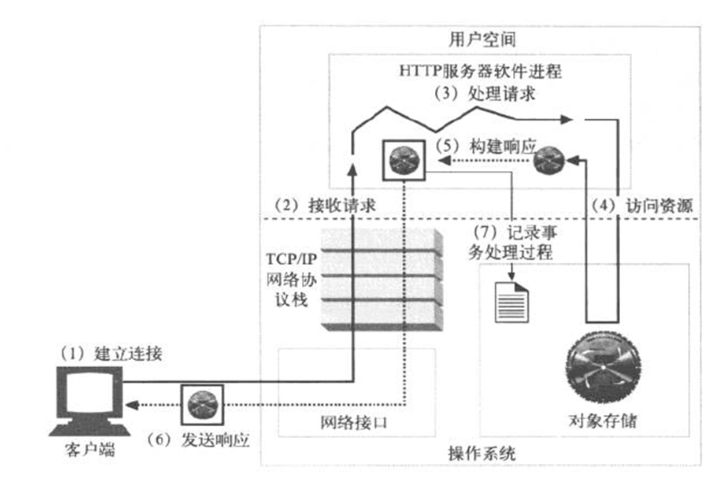

HTTP协议

通信模型：(OSI七层参考模型和TCP/IP模型)


套接字：

* IP:port(IP.port)
  - tcp/port
  - udp/port
  - IP报文的总长度，使用16位来表示，故最大长度不能超过65535bit，还得减去报文首部等；
  - IP报文的长度还受限于MTU(最大传输单元)，大于网络设备的MTU，将被再次切片；
* Unix Sock(最早由BSD实现)
  - 基于filesystem


传输层协议：

* 面向连接的:tcp(Transmisssion Control Protocol,传输控制协议)。需要建立专有的虚拟连接；
* 无连接的：udp(User Datagram Protocol,用户数据包协议)，在DNS、QQ、tftp等中使用的都是UDP。

套接字类型：

* TCP套接字：IP加TCP端口；
* UDP套接字：IP加UDP端口；
* raw套接字：raw socket，即原始套接字，可以接收本机网卡上的数据帧或者数据包，对于监听网络的流量和分析是很有作用的；


C/S通信模型：

* Client端：使用服务，使用本地的某个套接字，访问Sever端所监听的套接字上，主动打开；
* Server端：提供服务，向内核申请监听在本地的某个套接字上，被动等待(打开)。
* 连接组成：
  - ClientIP
  - ClientPort
  - ServerIP
  - ServerPort
  由同一客户端的同一程序发起多个进程的方式访问服务器端所建立的连接就属于不同的连接；
  此时，多个连接间唯一不同的只是ClientPort，故上述四个组成部分只要有一个不同即可标识一个不同的连接。

* C/S分工：
  - 通信子网(传输)
  - 应用层协议(特定应用)： http、https、smtp、pop、imap、ftp、ldap
  - 基于套接字通信的流程：


## http协议：

hypertext transport protocol，超文本传输协议；

http协议版本：

* http/0.9 : 1991年，仅用于传输html文档，纯文本；
* http/1.0 : 引入MIME，支持多媒体数据的处理，引入keep-alive(保持连接)，有缓存功能；
* http/1.1 : 支持更多的请求方法，更精细的缓存控制机制，原生支持持久连接；

目前比较流行的是1.0和1.1

MIME： Multipurpose Mail Extension： 多功能、多用途互联网邮件扩展；
引入base64编码：
    将二进制数据编码成文本发送，并能够让接收方还原回原来的格式；
    MIME：多媒体类型；
```
major/minor
    HTML:text/html
    ASCII:text/plagin
    JPEG:image/jpeg
    GIF:image/gif
    QuickTime(流媒体):video/quicktime
```

html：hypertext mark language，超文本标记语言

html格式的文件:

```html
  <html>
     <head>
        <title></title>
     </head>
     <boby>
          <h1></h1>
            <p></p>
           <h2></h2>
            <p>  <a href="a.html" > </a>  </p>
     </body>
   </html>
```
浏览器读取到使用html编写的文本后通过特定语法将其显示到浏览器上。

CSS: Cascading style sheet,层叠样式表；

动态页面： 除了html页面，还有程序脚本；

* 客户端脚本：不安全；
* 服务器端脚本： CGI(Common Gateway Interface,通用网关接口)
  - C,C++
  - perl
  - python
  - php 
  - asp.net
  - jsp

页面： 一个页面中，可能会包含多个页面对象；
URI：唯一标识web资源(页面对象)
    web资源引用方式：
        相对地址；
        绝对地址；

URI： Uniform Resource Identifier，同一资源标识符；
URL： Uniform Resource Locator，同一资源定位符，是URI的子集；
    URL： http://www.sslinux.com:80/images/logo.gif

C/S :

* Client: Browser:
  - GUI: Chrome Firefox,IE etc.
  - CLI: lynx elinks
* Server: http server


## HTTP报文

HTTP事务：一次请求以及与其对应的响应；




### HTTP方法(资源操作方法，请求方法)：

* GET: 请求一个资源，需要服务器发送；安全方法；
* HEAD：跟GET相似，但其不需要服务器发送资源，而仅传回响应报文的首部；安全的首部；
* POST：支持HTML表单提交，表单中有用户填入的数据，这些数据会发送至服务器端，由服务器存储至某位置(例如发送处理程序)。
* PUT：与GET相反，向服务器写入文档；例如：发布系统；包含主体；
* DELETE： 请求删除URL指向的资源；
* TRACE： 追踪请求资源要经过的防火墙、代理和网关等；
* OPTIONS：探测服务器端对某资源所支持的请求方法；
* 扩展方法：
  - LOCK
  - MKCOL
  - COPY
  - MOVE


### 首部分类：

* 1、通用首部
既可以出现在请求报文中，也可以出现在响应报文中；

通用的信息性首部：
  - Connection：定义C/S之间关于请求/响应的有关选项；对于http/1.0， Connection：keep-alive
  - Date: 提供日期和时间标志，说明报文时什么时间创建的；
  - MIME-Version： 给出聊发送端使用的MIME版本；
  - Trailer： 如果报文采用了分块传输编码(chunked transfer encoding)方式，就可以用这个首部列出位于报文拖鞋(trailer)部分的首部集合。
  - transfer-Encoding: 接收端为了保证报文的可靠传输，对报文采用了什么编码方式；
  - Update： 给出了发送端可能想要"升级"使用的新版本或协议；
  - Via： 显示 了报文经过的中间节点(代理、网关)。

通用缓存首部：
  - Cache-Control: 缓存指示；
  - Pragma： 另一种随报文传送指示的方式，但并不等于缓存；

* 2、请求首部

提供更多有关请求的信息；

请求的信息性首部：
  - 请求首部是在请求报文中有意义的首部。用于说明是谁或什么在发送请求，请求源自何处，或者客户端的喜好及能力。服务器可以根据请求首部给出的客户端的信息，试着为客户端提供更好的响应。
  - Client-IP: 提供了运行客户端的机器的IP地址；
  - From： 提供了客户端用户的E-mail地址；
  - Host： 请求的主机名和端口号，虚拟主机环境下用于不同的虚拟主机；
  - Referer： 指明了请求当前资源的原始资源的URL；
  - UA-Color： 提供了与客户端显示器的颜色有关的信息；
  - UA-CPU： 给出了客户端CPU的类型或制造商；
  - US-Disp： 提供了与客户端显示器(屏幕)有关的信息；
  - US-OS： 给出了客户端显示器的像素信息；
  - UA-Pixels： 提供了客户端显示器的娴熟信息；
  - User-Agent: 将发起请求的应用程序名称告知服务器(User-Agent)用户代理；即使用什么工具发出的请求；

Accept首部：
  - Accept： 指明服务器能发送的媒体类型；
  - Accept-Charset： 支持使用的字符集；
  - Accept-Encoding： 支持使用的编码方式；
  - Accept-Language： 支持使用的语言；
  - TE： 告诉服务器可以使用哪些扩展传输编码；

条件请求首部：
  - Expect： 允许客户端列出某请求所要求的服务器行为；
  - If-Match: 如果实体标记与文档当前的实体标记相匹配，就获得这份文档；
  - If-None-Match
  - If-Modified-Since: 是否在指定的时间以来修改过该资源，是就发新资源；
  - If-Range： 允许对文档的某个范围进行条件请求；
  - If-Unmodified-Since: 除非在某个指定的日期之后资源没有被修改过，否则就限制这个请求；
  - Range： 如果服务器支持范围请求，就请求资源的指定范围；

安全求求首部：
  - Authorization： 客户端提交给服务器端的认证数据，如账号和密码；
  - Cookie： 客户端发送给服务器端身份标识；
  - Cookie2： 用来说明请求端支持的Cookie版本；

代理请求首部：
  - 随着因特网网上代理的普遍应用，人们定义了几个首部来协助其更好地工作。
  - Max-Forword： 在通往远端服务器的路径上，将请求转发给其他代理或网关的最大次数，与TRACE方法一同使用；
  - Proxy-Authorization： 与Authorization首部相同，但这个首部实在与代理进行认证时使用的；
  - Proxy-Connection： 与Connection首部相同，但这个首部是在与代理建立连接时使用的；


* 3、响应首部
* 4、实体首部
* 5、扩展首部