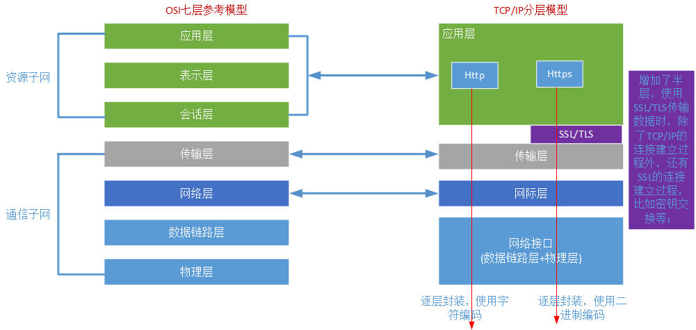
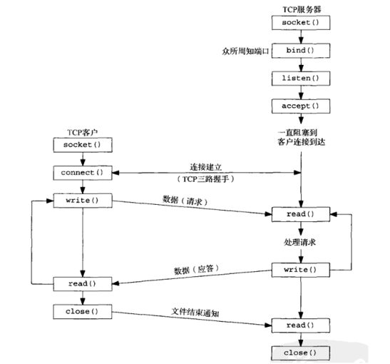
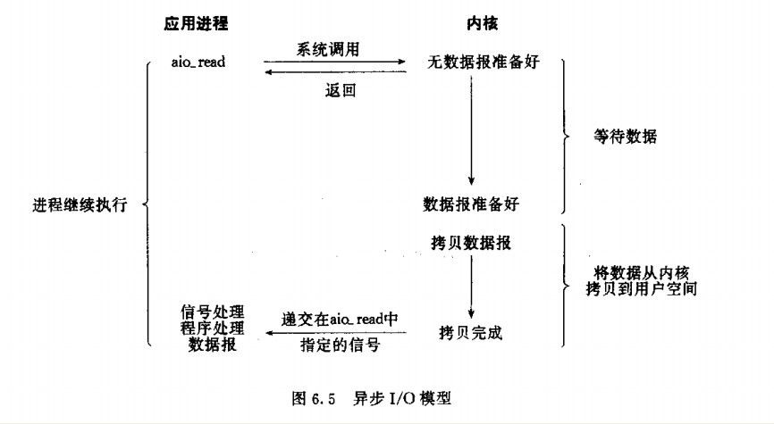
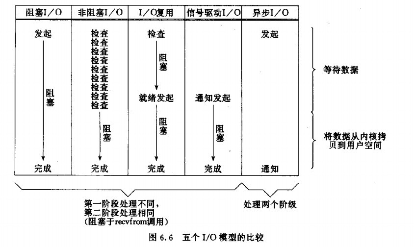

HTTP协议

通信模型：(OSI七层参考模型和TCP/IP模型)



套接字：

* IP:port(IP.port)
  - tcp/port
  - udp/port
  - IP报文的总长度，使用16位来表示，故最大长度不能超过65535bit，还得减去报文首部等；
  - IP报文的长度还受限于MTU(最大传输单元)，大于网络设备的MTU，将被再次切片；
* Unix Sock(最早由BSD实现)
  - 基于filesystem


传输层协议：

* 面向连接的:tcp(Transmisssion Control Protocol,传输控制协议)。需要建立专有的虚拟连接；
* 无连接的：udp(User Datagram Protocol,用户数据包协议)，在DNS、QQ、tftp等中使用的都是UDP。

套接字类型：

* TCP套接字：IP加TCP端口；
* UDP套接字：IP加UDP端口；
* raw套接字：raw socket，即原始套接字，可以接收本机网卡上的数据帧或者数据包，对于监听网络的流量和分析是很有作用的；


C/S通信模型：

* Client端：使用服务，使用本地的某个套接字，访问Sever端所监听的套接字上，主动打开；
* Server端：提供服务，向内核申请监听在本地的某个套接字上，被动等待(打开)。
* 连接组成：
  - ClientIP
  - ClientPort
  - ServerIP
  - ServerPort
  由同一客户端的同一程序发起多个进程的方式访问服务器端所建立的连接就属于不同的连接；
  此时，多个连接间唯一不同的只是ClientPort，故上述四个组成部分只要有一个不同即可标识一个不同的连接。

* C/S分工：
  - 通信子网(传输)
  - 应用层协议(特定应用)： http、https、smtp、pop、imap、ftp、ldap
  - 基于套接字通信的流程：




## http协议：

hypertext transport protocol，超文本传输协议；

http协议版本：

* http/0.9 : 1991年，仅用于传输html文档，纯文本；
* http/1.0 : 引入MIME，支持多媒体数据的处理，引入keep-alive(保持连接)，有缓存功能；
* http/1.1 : 支持更多的请求方法，更精细的缓存控制机制，原生支持持久连接；

目前比较流行的是1.0和1.1

MIME： Multipurpose Mail Extension： 多功能、多用途互联网邮件扩展；
引入base64编码：
    将二进制数据编码成文本发送，并能够让接收方还原回原来的格式；
    MIME：多媒体类型；
```
major/minor
    HTML:text/html
    ASCII:text/plagin
    JPEG:image/jpeg
    GIF:image/gif
    QuickTime(流媒体):video/quicktime
```

html：hypertext mark language，超文本标记语言

html格式的文件:

```html
  <html>
     <head>
        <title></title>
     </head>
     <boby>
          <h1></h1>
            <p></p>
           <h2></h2>
            <p>  <a href="a.html" > </a>  </p>
     </body>
   </html>
```
浏览器读取到使用html编写的文本后通过特定语法将其显示到浏览器上。

CSS: Cascading style sheet,层叠样式表；

动态页面： 除了html页面，还有程序脚本；

* 客户端脚本：不安全；
* 服务器端脚本： CGI(Common Gateway Interface,通用网关接口)
  - C,C++
  - perl
  - python
  - php 
  - asp.net
  - jsp

页面： 一个页面中，可能会包含多个页面对象；
URI：唯一标识web资源(页面对象)
    web资源引用方式：
        相对地址；
        绝对地址；

URI： Uniform Resource Identifier，同一资源标识符；
URL： Uniform Resource Locator，同一资源定位符，是URI的子集；
    URL： http://www.sslinux.com:80/images/logo.gif

C/S :

* Client: Browser:
  - GUI: Chrome Firefox,IE etc.
  - CLI: lynx elinks
* Server: http server


## HTTP报文

HTTP事务：一次请求以及与其对应的响应；


### HTTP方法(资源操作方法，请求方法)：

* GET: 请求一个资源，需要服务器发送；安全方法；
* HEAD：跟GET相似，但其不需要服务器发送资源，而仅传回响应报文的首部；安全的首部；
* POST：支持HTML表单提交，表单中有用户填入的数据，这些数据会发送至服务器端，由服务器存储至某位置(例如发送处理程序)。
* PUT：与GET相反，向服务器写入文档；例如：发布系统；包含主体；
* DELETE： 请求删除URL指向的资源；
* TRACE： 追踪请求资源要经过的防火墙、代理和网关等；
* OPTIONS：探测服务器端对某资源所支持的请求方法；
* 扩展方法：
  - LOCK
  - MKCOL
  - COPY
  - MOVE


### 首部分类：

* 1、通用首部
既可以出现在请求报文中，也可以出现在响应报文中；

通用的信息性首部：
  - Connection：定义C/S之间关于请求/响应的有关选项；对于http/1.0， Connection：keep-alive
  - Date: 提供日期和时间标志，说明报文时什么时间创建的；
  - MIME-Version： 给出聊发送端使用的MIME版本；
  - Trailer： 如果报文采用了分块传输编码(chunked transfer encoding)方式，就可以用这个首部列出位于报文拖鞋(trailer)部分的首部集合。
  - transfer-Encoding: 接收端为了保证报文的可靠传输，对报文采用了什么编码方式；
  - Update： 给出了发送端可能想要"升级"使用的新版本或协议；
  - Via： 显示 了报文经过的中间节点(代理、网关)。

通用缓存首部：
  - Cache-Control: 缓存指示；
  - Pragma： 另一种随报文传送指示的方式，但并不等于缓存；

* 2、请求首部

提供更多有关请求的信息；

请求的信息性首部：
  - 请求首部是在请求报文中有意义的首部。用于说明是谁或什么在发送请求，请求源自何处，或者客户端的喜好及能力。服务器可以根据请求首部给出的客户端的信息，试着为客户端提供更好的响应。
  - Client-IP: 提供了运行客户端的机器的IP地址；
  - From： 提供了客户端用户的E-mail地址；
  - Host： 请求的主机名和端口号，虚拟主机环境下用于不同的虚拟主机；
  - Referer： 指明了请求当前资源的原始资源的URL；
  - UA-Color： 提供了与客户端显示器的颜色有关的信息；
  - UA-CPU： 给出了客户端CPU的类型或制造商；
  - US-Disp： 提供了与客户端显示器(屏幕)有关的信息；
  - US-OS： 给出了客户端显示器的像素信息；
  - UA-Pixels： 提供了客户端显示器的娴熟信息；
  - User-Agent: 将发起请求的应用程序名称告知服务器(User-Agent)用户代理；即使用什么工具发出的请求；

Accept首部：
  - Accept： 指明服务器能发送的媒体类型；
  - Accept-Charset： 支持使用的字符集；
  - Accept-Encoding： 支持使用的编码方式；
  - Accept-Language： 支持使用的语言；
  - TE： 告诉服务器可以使用哪些扩展传输编码；

条件请求首部：
  - Expect： 允许客户端列出某请求所要求的服务器行为；
  - If-Match: 如果实体标记与文档当前的实体标记相匹配，就获得这份文档；
  - If-None-Match
  - If-Modified-Since: 是否在指定的时间以来修改过该资源，是就发新资源；
  - If-Range： 允许对文档的某个范围进行条件请求；
  - If-Unmodified-Since: 除非在某个指定的日期之后资源没有被修改过，否则就限制这个请求；
  - Range： 如果服务器支持范围请求，就请求资源的指定范围；

安全求求首部：
  - Authorization： 客户端提交给服务器端的认证数据，如账号和密码；
  - Cookie： 客户端发送给服务器端身份标识；
  - Cookie2： 用来说明请求端支持的Cookie版本；

代理请求首部：
  - 随着因特网网上代理的普遍应用，人们定义了几个首部来协助其更好地工作。
  - Max-Forword： 在通往远端服务器的路径上，将请求转发给其他代理或网关的最大次数，与TRACE方法一同使用；
  - Proxy-Authorization： 与Authorization首部相同，但这个首部实在与代理进行认证时使用的；
  - Proxy-Connection： 与Connection首部相同，但这个首部是在与代理建立连接时使用的；

---

* 3、响应首部

    提供更多有关响应的信息。

    响应报文有自己的响应首部集。响应首部为客户端提供了一些额外的信息，比如谁在发送响应、响应者的功能，甚至与响应相关的一些特殊指令。这些首部有助于客户端处理响应，并在将来发起更好的请求。

  - 响应的信息性首部：
    * Age： (从最初创建开始)响应持续时间；
    * Public：服务器为其资源支持的请求方法列表；
    * Retry-After：如果资源不可用的话，在此日期或时间重试；
    * Server： 向客户端标明服务器程序名称和版本；
    * Title： 对HTML文档来说，就是HTML文档的远端给出的标题；
    * Warn宁： 比原因短语中更详细的一些警告报文；

  - 协商首部：
    * 如果资源有多种表示方法，比如：如果服务器上有某文档的法语和德语译稿，HTTP/1.1可以为服务器和客户端提供对资源进行协商的能力。
    * Accept-Ranges： 对当前资源来说，服务器可接受的范围类型；
    * Vary： 首部列表，服务器会根据列表中的内容挑选出最适合的版本发送给客户端；
    
  - 安全响应首部：
    * HTTP的质询/响应认证机制的响应部；
    * Proxy-Authenticate： 来自代理的对客户端的质询列表；
    * Set-Cookie： 不是真正的安全首部，但隐含有安全功能；服务器端在某客户端第一次请求时给客户端发送令牌，以便服务器对客户端进行标识。
    * Set-Cookie2: 与Set-Cookie类似；
    * WWW-Authenticate: 质询，即要求客户端提供账号和密码；

* 4、实体首部

  用户指定实体属性；

  有很多首部可以用来描述HTTP报文的负荷。由于请求和响应文本中都可能包含实体部分，所以在这两种类型的报文中都可能出现这些首部。实体首部提供了有关实体及其内容的大量信息，从有关对象类型的信息，到能够对资源使用的各种有效的请求方法。总之，实体首部可以告知报文的接收者它在对什么进行处理。

  - 实体信息性首部：
    * Allow： 允许对此资源使用的请求方法；
    * Location： 资源的新位置；

  - 内容首部：
    * 内容首部提供了与实体内容有关的特定信息，说明了其类型、尺寸以及处理它所需的其他有用信息。比如，Web浏览器可以通过查看返回的内容类型，得知如何显示对象。
    * Content-Base： 解析主体中的相对URL时使用的基础URL；
    * Content-Encoding：对主体执行的任意编码方式；
    * Content-Language：理解主体时最适宜使用的自然语言；
    * Content-Length： 主体的长度或尺寸；
    * Content-Location： 资源实际所处的位置；
    * Content-MD5： 主体的MD5校验；
    * Content-Range： 在整个资源中此实体表示的字节范围；
    * Content-Type： 这个主体的对象模型；

  - 实体缓存首部：
    * 通用的缓存首部说明了如何或什么时候进行缓存。实体的缓存首部提供了与被缓存实体有关的信息，比如验证已缓存的资源副本是否仍然有效所需的信息，以及更好地估计已缓存资源何时失效所需的线索。
    * ETag： 与此实体有关的实体标记；
    * Expires： 实体不再有效，要从原始的远端再次获取此实体的日期和时间；
    * Last-Modified： 这个实体最后一次被修改的日期和时间；

* 5、扩展首部

  非标准首部，可能是由程序开发者创建的，例如： X-Forward-For

  每个HTTP首部都有一种简单的语法：名字后面跟着冒号(:), 然后跟上可选的空格，在跟上字段值。最后是一个回车换行；


---

HTTP请求： request -> HTTP请求报文：
        
* 报文格式：

```bash
<method> <request-URL> <version>    	#起始行，请求行；
<headers>

<entity-body>   

#首部：
    Name：Value
    Content-type：images/gif
```

* 参数解释：

```
    <method>:请求方法，希望服务器端能够执行的动作，如GET，HEAD、POST等
    <request-url>:请求的资源，可以是相对路径，也可以是完整的URL；
    <version>:协议版本，格式HTTP/<major>.<minor>,如http/1.0
    <headers>:HTTP首部
    <status>:状态码
    <reason-phrase>:原因短语，数字状态码易读信息
    <entity-body>:主体部分；
```

HTTP响应： response -> HTTP响应报文：

* 报文格式：

```bash
<version> <status> <reason-phrase>   # 起始行，响应行
<headers>

<entity-body>   # 响应主体
```

* 响应报文状态码：

  - 1xx： 信息性状态码
    * 100 continue
    * 101 切换协议
  - 2xx： 成功状态码
    * 200 ok，确定，客户端请求已成功；
    * 201 Created，已创建；
    * 202 已接受；
    * 203 非权威信息；
    * 204 无内容；
    * 205 重置内容；
    * 206 部分内容；
    * 207 多状态(WebDAV)
  - 3xx: 重定向状态码
    * 301 moved permanently 永久重定向，在响应报文中使用首部"Location:URL" 指定资源现在所处的位置；
    * 302 Found  临时重定向，在响应报文中使用首部"Location： URL"，指定临时资源位置；
    * 304 Not Modified 条件式请求时使用，相对于缓存中已有的进行比较；
  - 4xx： 客户端类型的错误；
    * 403 Forbidden，请求被服务器拒绝；
    * 404 Not Found，服务器无法找到请求的URL；
    * 405 Method Not Allowed，不允许使用此方法请求相应的URL；
  - 5xx： 服务器类的错误
    * 500 Internal Server Error，服务器内部错误；
    * 502 Bad Gateway，代理服务器从上游收到一条伪响应；
    * 503 Service Unavailable，服务器此时无法提供服务，但将来可能可用；

一次完整的http连接：

* 1.名称解析(hosts,DNS)
* 2.客户端与服务端的基于tcp连接的三次握手；
* 3.请求资源，响应资源；
* 4.TCP四次断开；


一次HTTP事务结束后，连接即行断开，带来的结果是效率较低，

加速方式：

* 1. 并行连接(第一次只能是一个，即URL中指定的一个)；
  - 并行连接的确定：
    * 每个事务都会打开/关闭一条心得连接，会耗费时间和带宽；
    * 由于TCP的慢启动特性的存在，每条新连接的性能会有所降低；
    * 可打开的并行连接数量实际上是有限的；

* 持久连接(请求资源后不断开，继续请求资源，直到请求完毕后断开)；

  - 两种实现： 二者谁先满足都会断开；
    * 限定超时时间；
    * 限定单次持久连接所能请求的资源数量；
  - 持久连接避免了多次TCP连接、断开，但也导致了高并发时的用户等待；调优时，需要寻找一个折衷点；


* 一次Web请求的基本过程： web服务器输入/输出结构；
  - 1.建立连接；
  - 2.接收请求
  - 3.处理请求
  - 4.访问资源
  - 5.构建响应
  - 6.发送响应
  - 7.记录日志

sendfile()机制，减少文件在内存中的复制次数，从而节约服务器内存资源；


### http： C/S 

* Client GUI:
  - IE
  - FireFox
  - Safari
  - Chrome
  - Opera

* Client CLI:
  - elinks
  - curl

* Server:
  - ASF: httpd
  - Nginx
  - lighttpd
  - App Server:
    * IIS
    * tomcat
    * jetty
    * resin

---

## httpd(Apache)

历史：

```
俗称Apache，任务完成后程序员自发组织继续维护；
在原有Apache上打了很多补丁，顾戏称为 a pachey server = apache 
Apache野蛮生长后，反正成为一个软件基金会；
```

### httpd的高度模块化：

使用 core + modules的模式开发；

DSO： Dynamic Shared Object， 动态共享对象；

* MPM： Multipath Processing Module，多道处理模块：

    并非一个模块，而是对一种特性的称谓；
  - prefork： 一个进程一个请求，基于select()模型；

    创建子进程的过程：
      * 创建task_struct: 任务结构；
      * 为子进程分配内存；

    prefork即为提前创建子进程：
      * 需设定最小空闲进程数；
      * 需设定最大空闲数；
      * 需设定最大进程数上限；

  - worker： 一个进程多个线程，一个线程响应一个请求；
    *  相对于prefork：优点：节约内存； 但稳定性不如prefork；
  - event： event-driven： 事件驱动，主要目的在于实现单线程响应多个请求；
    * 单线程响应多个请求，基于事件驱动；

---

### httpd版本：

* httpd-1.3
* httpd-2.0
* httpd-2.2： CentOS6默认支持，不支持event；
* httpd-2.4： CentOS7默认支持，支持event。

### httpd的功能特性：

* 路径别名： alias
* 用户认证： authentication
  - 基本认证
  - 摘要认证
* 虚拟主机： virtual host
* 反向代理： 负载均衡
* 用户站点： 当前系统上的用户都可以自行创建一个站点；
* CGI： Common Gateway Interface，通用网关接口；

### 安装httpd：

* rpm -ivh httpd-version.rpm
* yum install -y httpd

* rpm -ql httpd(组织方式)：
  - 脚本配置文件： /etc/sysconfig/httpd 
  - 运行目录：/etc/httpd/
  - 配置文件：
    * 主配置文件： /etc/httpd/conf/httpd.conf,可调用所有配置文件；
    * 扩展配置： /etc/httpd/config.d/*.conf
  - Socket: 
    * 80/tcp
    * 443/tcp
  - 模块目录： /usr/lib64/httpd/modules/
  - 可执行文件目录：/usr/sbin/
  ```
    /usr/sbin/apachectl
    /usr/sbin/fcgistarter
    /usr/sbin/htcacheclean
    /usr/sbin/httpd
    /usr/sbin/rotatelogs
    /usr/sbin/suexec
  ```
  - 默认文档根目录： /var/www/html
  - CGI目录： /var/www/cgi-bin
  - DocRoot文档根目录： 在访问文件时，其目录是相对于DocRoot目录而言；

* 日志滚动：/etc/logrotate.d/httpd
  - 日志切割；
  - 两种滚法：
    * 时间： 按指定时间进行滚动；
    * 空间： 日志文件到达指定大小后进行滚动；

* 配置文件： /etc/httpd/conf/httpd.conf 
  - 使用 "配置参数 值" 的格式
    * 配置指令不区分字符大小写；
    * 值有可能区分字符大小写；
    * 有些指令可以重复出现多册；
  - 配置文件格式：
    * 全局配置
    * 主机配置：用于仅提供一个站点时；
    * 虚拟主机： 用于提供多个站点时；
    * 配置文件语法测试： # httpd -t
    * 绝大多数配置修改后，可以使用systemctl reload httpd.service
    * 如果修改了监听地址或端口，必须重启服务：systemctl restart httpd.service才能生效；

### httpd.conf配置文件详解(基本)

1. 监听套接字： Listen [IP:]port
  此指令可以出现多次，用于指定监听多个不同的套接字；

2. 配置使用keepalive：

```bash
KeepAlive {On|Off}
KeepAliveTimeout 2    # 保持持久连接的超时时间，单位为秒
MaxKeepAliveRequests 50  # 保持持久连接的最大请求数；
```

使用telnet测试KeepAlive开启前后的差别：

```bash
Connecting to 172.16.21.9:80...
Connection established.
To escape to local shell, press 'Ctrl+Alt+]'.
Get /index.html http/1.1
Host 172.16.21.9

#此处必须有一空行后，再次回车；
```

超时或最大请求数，谁先满足，谁先断开；

3. MPM: 多道处理模块；

```bash
[root@blog ~]# httpd -l   # 查看编译进核心的模块；
Compiled in modules:
  core.c
  mod_so.c
  http_core.c
```

在httpd2.2中，虽然是多道处理模块，但prefork、worker只能将其中一个编译进核心；
想使用不同的机制，修改配置文件即可/etc/sysconfig/httpd文件

```bash
<IfModule preforck.c>  #判断模块是否存在
	StartServers       8      #默认启动的工作进程数，不包括主进程；
	MinSpareServers    5   #最少空闲进程数
	MaxSpareServers   20 #最大空闲进程数
	ServerLimit      256 #最大活动进程数   ServerLimit 大于等于MaxClients
	MaxClients       256 #最大并发连接数，最多允许发起的连接请求的个数
	MaxRequestsPerChild  4000 #每个子进程在生命周期内最大允许服务的最多请求个数
  </IfModule>
```

```bash
<IfModule worker.c>
	StartServers         4          #启动的子进程的个数
	MaxClients         300        #最大并发连接数，最多允许发起的连接请求的个数
	MinSpareThreads     25    #最少空闲线程数
	MaxSpareThreads     75   #最大空闲线程数
	ThreadsPerChild     25      #每个子进程生成的线程数
	MaxRequestsPerChild  0   #每个子进程在生命周期内最大允许服务的最多请求个数，0表示不限定
	</IfModule>
# worker也可以有ServerLimit，其值不能小于MaxClients/ThreadsPerChild 的值；
```

4. DSO模块的加载方式： 

  格式： LoadModule module_name /path/to/module

  例如： LoadModule php5_module /usr/lib64/httpd/modules/php5.so

  如果使用相对路径，则是相对于ServerRoot所定义的目录；

  让服务reload配置文件方能生效；

  httpd -M 列出已装载的所有DSO模块与非DSO模块；取消的话，注释掉即可；

  httpd -l 列出支持使用的非DSO模块
  
```bash
[root@blog ~]# ls /usr/lib64/httpd/modules/ | grep prefork
mod_mpm_prefork.so
[root@blog ~]# ls /usr/lib64/httpd/modules/ | grep worker
mod_mpm_worker.so
[root@blog ~]# ls /usr/lib64/httpd/modules/ | grep event
mod_mpm_event.so
```

装载模块：

```bash
[root@blog ~]# cat /etc/httpd/conf/httpd.conf | grep ^LoadModule
LoadModule mpm_prefork_module /usr/lib64/httpd/modules/mod_mpm_prefork.so
LoadModule mpm_worker_module /usr/lib64/httpd/modules/mod_mpm_worker.so
LoadModule mpm_event_module /usr/lib64/httpd/modules/mod_mpm_event.so
# module_name 就得按这样写，改了之后会报无效的标识；
```

5. 配置站点根目录： DocumentRoot /path/to/somewhere，默认是/var/www/html

6. 页面访问属性：

```bash
<Direcotry "/path/to/somewhere">
    Options 选项；访问方式，http://httpd.apache.org/docs/2.2/mod/core.html#options
        Indexes：缺少指定的默认页面时，允许将站点根目录中的所有文件以列表形式返回给用户：危险：慎用
        FollowSymLinks:允许跟随符号链接所指向的原始文件
        None：所有都不启用
        All：所有的都启用
        ExecCGI：允许使用mod_cgi模块执行CGI脚本
        Includes：允许使用mod_include模块实现服务器端包含(SSI)
        IncludesNOEXEC：允许包含但不允许执行脚本
        MultiViews：允许使用mod_negotiation实现内容协商
        SymLinksIfOwnerMatch:在链接文件属主属组与原始文件的属主属组相同时，允许跟随符号连接所指向的原始文件
    AllowOverride None
    Require all granted
</Direcotry>

# 可以使用正则表达式，使用~
```

* 认证：
  - http协议认证：
    * 基于IP认证机制；
    * 基于用户认证；
  - 表单认证： 常用；

7. 基于主机的访问控制：

```bash
<Direcotry "/path/to/somewhere">
    Options 
    AllowOverride None 不禁用下面
    order 次序，写在后面的为默认
        allow,deny: 没有明确允许的都拒绝
        deny,allow：没有明确拒绝的都允许
    Allow from
    Deny from
</Direcotry>
```

```bash
# 如果二者都匹配或都不匹配时以默认(后面的)为准
# 否则则以匹配到的为准
Allow from
Deny from
    IP,Network Address
    172.16
    172.16.0.0
    172.16.0.0/16
    172.16.0.0/255.255.0.0
# 基于IP做访问控制
```

```bash
<Directory "/var/www/html">
    Options Indexes FollowSymLinks
    AllowOverride None
    Order allow,deny
    Allow from 192.168.1.0/24
    Deny from 192.168.1.28/255.255.255.255 # 28这个ip不能访问；
    Require all granted
</Directory>
```

8. 定义默认页面： DirectoryIndex index.html index.html.var 依次查找；

9. 用户目录： 

如果期望让每个用户都可以创建个人站点：http://Server_IP/~Username/

```bash
userdir disablied:禁止
userdir public_html
# public_html是用户家目录下的目录名称，所有位于此目录中的文件均可通过前述的访问路径进行访问
```

前提：用户的家目录得赋予进行httpd进程的用户拥有执行权限

```bash
[root@blog ~]# setfacl -m u:apache:x ~sslinux
[root@blog ~]# getfacl ~sslinux
getfacl: Removing leading '/' from absolute path names
# file: home/sslinux
# owner: sslinux
# group: sslinux
user::rwx
user:apache:--x
group::---
mask::--x
other::---

[root@blog ~]# 
```

10. 配置日志功能： /var/log/httpd/

* access.log: 访问日志，其需要记录的内容需要自定义；
* error.log : 错误日志；

```bash
访问日志：
CustomLog "/path/to/log_file" LogFormat
LogFormat  Format_String Format_name
# LogFormat定义日志格式
"%h %l %u %t \"%r\" %>s %b \"%{Referer}i\" \"%{User-Agent}i\""
    %h:客户端地址
    %l:远程的登录名，通常为-(dash)
    %u:认证时的远程用户名，通常为-
    %t：接收到的请求时的时间，为标准英文格式时间+时区
    \" ：转义，显示""
    %r:请求报文的起始行,"方法，URL，协议版本"
    %>s：响应状态码，
    %b：以字节为单位响应报文的长度，不包含http首部；
    %{Header_Name}i:记录指定请求报文首部的内容（value）
    %{User-Agent}i    ：用户代理，即用户访问使用的工具，浏览器等；
    %u：请求的URL
        
详情请参考：http://httpd.apache.org/docs/2.2/mod/mod_log_config.html#formats
 错误日志：ErrorLog
```

示例：

```bash
<IfModule log_config_module>
    #
    # The following directives define some format nicknames for use with
    # a CustomLog directive (see below).
    #
    LogFormat "%h %l %u %t \"%r\" %>s %b \"%{Referer}i\" \"%{User-Agent}i\"" combined
    LogFormat "%h %l %u %t \"%r\" %>s %b" common

    <IfModule logio_module>
      # You need to enable mod_logio.c to use %I and %O
      LogFormat "%h %l %u %t \"%r\" %>s %b \"%{Referer}i\" \"%{User-Agent}i\" %I %O" combinedio
    </IfModule>

    #
    # The location and format of the access logfile (Common Logfile Format).
    # If you do not define any access logfiles within a <VirtualHost>
    # container, they will be logged here.  Contrariwise, if you *do*
    # define per-<VirtualHost> access logfiles, transactions will be
    # logged therein and *not* in this file.
    #
    #CustomLog "logs/access_log" common

    #
    # If you prefer a logfile with access, agent, and referer information
    # (Combined Logfile Format) you can use the following directive.
    #
    CustomLog "logs/access_log" combined
</IfModule>
```

11. 路径别名： Alias /alias/ "/path/to/somewhere" 

    意味着访问http://Server_IP/alias时，其页面文件来自于/path/to/somewhere中；

    例如： Alias /root "/var/www/html"

12. 指定默认的字符集： AddDefaultCharset 

    例如：AddDefaultCharset UTF-8

---

## httpd配置详解(高级)

### 1.脚本路径别名(CGI接口) : 此处表述不清，后期补充；

URL --> Filesystem Directory

CGI: Common Gateway Interface
* mod_alias
* mod_cgi
* CGI(通用网关接口)使Web可以跟一个应用程序进行交互，从通信环境中获得结果。
* CGI是不安全的，在第一行写入： echo "Content-Type: text/html"
* ScriptAlias /URL/ "/path/to/somewhere"  , somewhere下的文件可以被执行，也可以在目录中实现；
* 格式一般为：

```bash
cat << EOF
Content-Type: text/html
<pre>
<h1>The time is: `date`.</h1>
</pre>
EOF
```

### 2.基于用户的访问控制

请求-->质询(首部:WWW-Authenticate)-->认证(首部:Authenrization)-->成功(首部:Authentication-Info)

虚拟用户：不是系统用户，只是为了获取某种资源类型的一种虚拟的用户
	   文件/etc/httpd/conf/.htpasswd
	   SQL数据库
	   dbm：
	   ldap:轻量级目录访问协议

认证类型(auth)：
    basic：基本认证，账号和密码明文发送
    digest：摘要认证，hash编码之后发送
认证提供者(authentication provider):账号和密码的存放位置
    authn
授权机制(authorization):根据什么进行授权
    authz      

* 案例：基于文件，做基本认证，根据用户和组进行授权

  - 1.编辑配置文件，为需要认证的目录配置认证机制；

```bash
<Directory "/www/htdocs/fin">
    options None
    AllowOverride AuthConfig 使用认证配置
    AuthType Basic 使用基本认证
    AuthName "Private Area" 质询时标题
    AuthUserFile /etc/http/conf/.htpasswd  密码的存放位置
    Require valid-user 可访问的用户
</Directory>
```
  - 2.使用htpasswd命令生成认证库：

```bash
 htpasswd命令
      -c 创建文件，创建第一个用户时使用
      htpasswd -c -m /etc/http/conf/.htpasswd tom
      -m MD5格式存放
      -b 批量模式
      -D 删除用户
```

  - 3、基于组认证：

```bash
    <Directory "/www/htdocs/fin">
        options None
        AllowOverride AuthConfig 使用认证配置
        AuthType Basic 使用基本认证
        AuthName "Private Area" 质询时标题
		AuthUserFile /etc/http/conf/.htpasswd
        AuthgroupFile /etc/http/conf/.grpasswd  密码的存放位置
        Require group testgroup  可访问的用户
    </Directory>

       先创建用户，再创建组
       组文件：
         组名：用户1 用户2 用户3
		testgroup: tom
```

### 3.虚拟主机

一个物理服务器提供多个站点；使用虚拟主机必须先取消中心主机；

主服务器和虚拟主机不能并存，若要使用虚拟主机，先把主服务器中的DocumentRoot注释掉；

* 虚拟主机：
  - 基于ip的虚拟主机： 变化IP
  - 基于port的虚拟主机： 变化port

  ```bash
    <VirtualHost IP:port>
      		SeverName
      		DocumentRoot "/PATH"
      <Directory "">
			Options
      </Directory>
      		ServerAlias
     		 ServerAdmin
    </VirtualHost>
  ```
  
  - 基于FQDN(主机名)的虚拟主机： 变化ServerName：
    * 依靠HTTP请求报文中的Host首部区分访问的主机；
    * 在httpd2.2中，使用基于FQDN的虚拟主机，必须启用NameVirtualHost *:80行，且在虚拟主机中定义时IP与port需与此处一致；

  - 虚拟主机的单独配置： 和主服务器中的配置一样
    * 用户认证
    * 访问日志
    * 错误日志
    * 路径别名  
    * 脚本别名
    
### 4.https协议


### 5.服务器status页面
### 6.curl命令
### 7.mod_deflate模块
### 8.httpd自带的工具
### 9.资源限定
### 10.ab工具的初步使用
### 11.httpd-2.4编译安装


## I/O

### 阻塞(Block)： 进程发起I/O调用，未完成之前，当前进程会被挂起；  调用者；

* 阻塞调用是指调用结果返回之前，当前线程会被挂起（线程进入非可执行状态，在这个状态下，cpu不会给线程分配时间片，即线程暂停运行）。函数只有在得到结果之后才会返回。

* 有人也许会把阻塞调用和同步调用等同起来，实际上他是不同的。对于同步调用来说，很多时候当前线程还是激活的，只是从逻辑上当前函数没有返回而已。

* 例如，我们在socket中调用recv函数，如果缓冲区中没有数据，这个函数就会一直等待，直到有数据才返回。而此时，当前线程还会继续处理各种各样的消息。

* 快递的例子：比如你在某个时候到A楼一层（假如是内核缓冲区）取快递，但是你不知道快递什么时候过来，你又不能干别的事，只能死等着。但你可以睡觉（进程处于休眠状态），因为你知道快递把货送来时一定会给你打个电话（假定一定能叫醒你）。


### 非阻塞(Unblock): 进程发起I/O调用，被调用函数完成之前不会阻塞当前进程，而是立即返回；盲等； 调用者；

* 非阻塞和阻塞的概念相对应，指在不能立刻得到结果之前，该函数不会阻塞当前线程，而会立刻返回。

* 还是等快递的例子：如果用忙轮询的方法，每隔5分钟到A楼一层(内核缓冲区）去看快递来了没有。如果没来，立即返回。而快递来了，就放在A楼一层，等你去取。

* 同步IO和异步IO的区别就在于：数据拷贝的时候进程是否阻塞！
* 阻塞IO和非阻塞IO的区别就在于：应用程序的调用是否立即返回！

### 同步(Sync): 进程发起一个过程(功能、函数)调用后，在没得到结果之前，该调用将不会返回；

* 所谓同步，就是在发出一个功能调用时，在没有得到结果之前，该调用就不返回。
* 也就是必须一件一件事情的做，等前一件做完了才能做下一件；
* 例如：普通B/S模式(同步): 提交请求 -> 等待服务器处理 -> 处理完毕返回  这个期间客户端浏览器不能干任何事；

### 异步(Async): 进程发起一个过程调用，即使调用者不能立即得到结果，但调用却会返回，返回的是未完成状态；当调用完成后，内核会自行通知调用者结果已经OK。

* 异步的概念和同步相对。当一个异步过程调用发出后，调用者不能立刻得到结果。实际处理这个调用的部件在完成后，通过状态、通知和回调来通知调用者。

* 例如 ajax请求（异步）: 请求通过事件触发->服务器处理（这时浏览器仍然可以作其他事情）->处理完毕

### 同步阻塞

### 异步阻塞


## Linux下的五种I/O模型

同步：

* 阻塞I/O(blocking I/O)

    应用程序调用一个IO函数，导致应用程序阻塞，等待数据准备好。 如果数据没有准备好，一直等待….数据准备好了，从内核拷贝到用户空间,IO函数返回成功指示。

   

* 非阻塞I/O(noblocking I/O)

我们把一个SOCKET接口设置为非阻塞就是告诉内核，当所请求的I/O操作无法完成时，不要将进程睡眠，而是返回一个错误。这样我们的I/O操作函数将不断的测试数据是否已经准备好，如果没有准备好，继续测试，直到数据准备好为止。在这个不断测试的过程中，会大量的占用CPU的时间。


* I/O复用(select 和 poll) (I/O multiplexing) : select(),poll()

主要是select和epoll；对一个IO端口，两次调用，两次返回，比阻塞IO并没有什么优越性；关键是能实现同时对多个IO端口进行监听；

I/O复用模型会用到select、poll、epoll函数，这几个函数也会使进程阻塞，但是和阻塞I/O所不同的的，这两个函数可以同时阻塞多个I/O操作。而且可以同时对多个读操作，多个写操作的I/O函数进行检测，直到有数据可读或可写时，才真正调用I/O操作函数。


* 信号驱动I/O (signal dtriven I/O(SIGIO)) : epoll(),kqueue()  
  - 边缘触发
  - 水平触发

    两次调用，两次返回:

    首先我们允许套接口进行信号驱动I/O,并安装一个信号处理函数，进程继续运行并不阻塞。当数据准备好时，进程会收到一个SIGIO信号，可以在信号处理函数中调用I/O操作函数处理数据。


异步：

* 异步I/O (asynchronous I/O (the POSIX aio_functions)) 

数据拷贝的时候进程无需阻塞。

    当一个异步过程调用发出后，调用者不能立刻得到结果。实际处理这个调用的部件在完成后，通过状态、通知和回调来通知调用者的输入输出操作




## 五种IO模型的比较：



