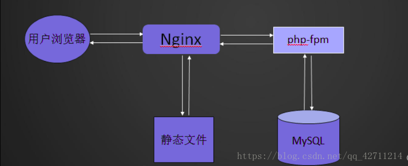
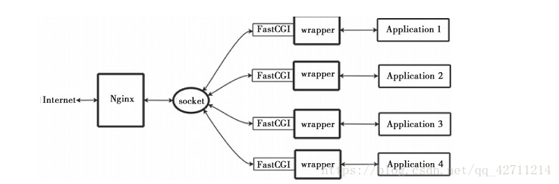

## 一、了解LNMP架构

LNMP代表的就是：Linux系统下Nginx+MySQL+PHP这种网站服务器架构。

(1)Linux是一类Unix计算机操作系统的统称，是目前最流行的免费操作系统。代表版本有：debian、centos、ubuntu、fedora、gentoo等。

(2)Nginx是一个高性能的HTTP和反向代理服务器，也是一个IMAP/POP3/SMTP代理服务器。

(3)Mysql是一个小型关系型数据库管理系统。 PHP是一种在服务器端执行的嵌入HTML文档的脚本语言。

(4)这四种软件均为免费开源软件，组合到一起，成为一个免费、高效、扩展性强的网站服务系统。

lnmp架构部署示意图：



### 1.Apache+PHP 和 Nginx+PHP的区别

Apache一般是把PHP当做自己的一个模块来启动；而Ngnix则是把http请求变量转发给PHP进程，即PHP独立进程，与Ngnix通信，这种方式叫做Fast-CGI运行方式。所以Apache所编译的PHP不能用于Nginx。


### 2.什么是Fast-CGI？

Fast-CGI是一个可伸缩的、高速的在HTTP server和动态脚本语言间通信的接口。多数流行的HTTP server都支持Fast-CGI，包括Apache、Nginx和lighttpd等。同时，Fast-CGI也被许多脚本语言支持，其中就有PHP。
　　Fast-CGI是从CGI发展改进而来的。传统CGI接口方式的主要缺点是性能很差，因为每次HTTP服务器遇到动态程序时都需要重新启动脚本解析器来执行解析，然后将结果返回给HTTP服务器。这在处理高并发访问时几乎是不可用的。另外传统的CGI接口方式安全性也很差，现在已经很少使用了。
　　FastCGI接口方式采用C/S结构，可以将HTTP服务器和脚本解析服务器分开，同时在脚本解析服务器上启动一个或者多个脚本解析守护进程。当HTTP服务器每次遇到动态程序时，可以将其直接交付给Fast-CGI进程来执行，然后将得到的结果返回给浏览器。这种方式可以让HTTP服务器专一地处理静态请求或者将动态脚本服务器的结果返回给客户端，这在很大程度上提高了整个应用系统的性能。

### 3.Nginx+Fast-CGI运行原理

Nginx不支持对外部程序的直接调用或者解析，所有的外部程序（包括PHP）必须通过Fast-CGI接口来调用。Fast-CGI接口在Linux下是socket（这个socket可以是文件socket，也可以是ip socket）。

wrapper：为了调用CGI程序，还需要一个Fast-CGI的wrapper（wrapper可以理解为用于启动另一个程序的程序），这个wrapper绑定在某个固定socket上，如端口或者文件socket。当Nginx将CGI请求发送给这个socket的时候，通过Fast-CGI接口，wrapper接收到请求，然后Fork（派生）出一个新的线程，这个线程调用解释器或者外部程序处理脚本并读取返回数据；接着，wrapper再将返回的数据通过Fast-CGI接口，沿着固定的socket传递给Nginx；最后，Nginx将返回的数据（html页面或者图片）发送给客户端。这就是Nginx+Fast-CGI的整个运作过程。



---

## mysql源码编译：

* 1.下载cmake-2.8.12.2-4.el6.x86_64.rpm 和mysql-boost-5.7.17.tar.gz
* 2.安装源码编译工具cmake（支持编译C++语言）：cmake跨平台工具是用来预编译mysql源码的，用于设置mysql的编译参数。如：安装目录、数据存放目录、字符编码、排序规则等

```bash
[root@apache nginx]# yum info cmake
Loaded plugins: fastestmirror
Loading mirror speeds from cached hostfile
 * base: mirrors.163.com
 * epel: mirrors.yun-idc.com
 * extras: mirror.lzu.edu.cn
 * updates: mirror.lzu.edu.cn
Available Packages
Name        : cmake
Arch        : x86_64
Version     : 2.8.12.2
Release     : 2.el7
Size        : 7.1 M
Repo        : base/7/x86_64
Summary     : Cross-platform make system
URL         : http://www.cmake.org
License     : BSD and MIT and zlib
Description : CMake is used to control the software compilation process using simple
            : platform and compiler independent configuration files. CMake generates
            : native makefiles and workspaces that can be used in the compiler
            : environment of your choice. CMake is quite sophisticated: it is possible
            : to support complex environments requiring system configuration, preprocessor
            : generation, code generation, and template instantiation.

[root@apache nginx]# yum install cmake -y
```

* 3.解压源码包:tar zxf mysql-boost-5.7.25.tar.gz 
* 4.cd mysql-5.7.25/

```bash
[root@apache ~]# tar zxf mysql-boost-5.7.25.tar.gz 
[root@apache ~]# cd mysql-5.7.25/
```

* 5.创建预编译环境，可以定制即加上自己所需的安装条件（比如安装位置等等）

```bash
[root@apache mysql-5.7.25]# cmake -DCMAKE_INSTALL_PREFIX=/usr/local/lnmp/mysql \
> -DMYSQL_DATADIR=/usr/local/lnmp/mysql/data \
> -DMYSQL_UNIX_ADDR=/usr/local/lnmp/mysql/data/mysql.sock \
> -DWITH_MYISAM_STORAGE_ENGINE=1 \
> -DWITH_INNOBASE_STORAGE_ENGINE=1 \
> -DDEFAULT_CHARSET=utf8 \
> -DDEFAULT_COLLATION=utf8_general_ci \
> -DEXTRA_CHARSETS=all

# 安装目录：-DCMAKE_INSTALL_PREFIX=/usr/local/lnmp/mysql
# 数据库存放目录： -DMYSQL_DATADIR=/usr/local/lnmp/mysql/data
# unix socket文件路径： -DMYSQL_UNIX_ADDR=/usr/local/lnmp/mysql/data/mysql.sock
# 安装myisam存储引擎： -DWITH_MYISAM_STORAGE_ENGINE=1
# 安装innodb存储引擎： -DWITH_INNOBASE_STORAGE_ENGINE=1
# 使用utf8字符： -DDEFAULT_CHARSET=utf8
# 校验字符： -DDEFAULT_COLLATION=utf8_general_ci
# 安装所有扩展字符集： -DEXTRA_CHARSETS=all
```

* 6.直接执行完上面命令后,会报错,要解决一系列依赖性

```bash
yum install gcc gcc-c++ -y                 
rm -fr CMakeCache.txt   
```

cmake后加入语句-DWITH_BOOST=boost/boost_1_59_0/ 并删除CMakeCache.txt（编译缓存文件信息）

```bash
[root@apache mysql-5.7.25]# cmake -DCMAKE_INSTALL_PREFIX=/usr/local/lnmp/mysql -DMYSQL_DATADIR=/usr/local/lnmp/mysql/data -DMYSQL_UNIX_ADDR=/usr/local/lnmp/mysql/data/mysql.sock -DWITH_MYISAM_STORAGE_ENGINE=1 -DWITH_INNOBASE_STORAGE_ENGINE=1 -DDEFAULT_CHARSET=utf8 -DDEFAULT_COLLATION=utf8_general_ci -DEXTRA_CHARSETS=all -DWITH_BOOST=boost/boost_1_59_0/
```

```bash
# error:
-- Could NOT find Curses (missing:  CURSES_LIBRARY CURSES_INCLUDE_PATH) 
CMake Error at cmake/readline.cmake:64 (MESSAGE):
  Curses library not found.  Please install appropriate package,

      remove CMakeCache.txt and rerun cmake.On Debian/Ubuntu, package name is libncurses5-dev, on Redhat and derivates it is ncurses-devel.
Call Stack (most recent call first):
  cmake/readline.cmake:107 (FIND_CURSES)
  cmake/readline.cmake:197 (MYSQL_USE_BUNDLED_EDITLINE)
  CMakeLists.txt:541 (MYSQL_CHECK_EDITLINE)
```

```bash
yum install ncurses-devel -y  #ncurses-devel为字符终端处理库
rm -fr CMakeCache.txt   
```

```bash
[root@apache mysql-5.7.25]# yum install -y bison  ##linux下c/c++语法分析器
```

* 7.编译 make && make install 


* 8.配置mysql

1）进入源码编译目录，再进入mysql安装的位置，将编译完成的默认配置文件放在/etc下

cd /usr/local/lnmp/mysql/                        # mysql的安装位置
cd support-files/                      # 配置文件所在位置
cp my-default.cnf /etc/my.cnf          # 将配置文件拷贝到/etc（系统默认配置文件目录）

2）配置mysql服务

```bash
[root@apache support-files]# vim /etc/my.cnf         ##编辑mysql配置文件
[root@apache support-files]# cat /etc/my.cnf
[mysqld]
basedir=/usr/local/lnmp/mysql
datadir=/usr/local/lnmp/mysql/data
port=3306
socket=/usr/local/lnmp/mysql/data/mysql.sock
# Disabling symbolic-links is recommended to prevent assorted security risks
symbolic-links=0
# Settings user and group are ignored when systemd is used.
# If you need to run mysqld under a different user or group,
# customize your systemd unit file for mariadb according to the
# instructions in http://fedoraproject.org/wiki/Systemd

[mysqld_safe]
log-error=/var/log/mariadb/mariadb.log
pid-file=/var/run/mariadb/mariadb.pid

#
# include all files from the config directory
#
!includedir /etc/my.cnf.d
```

3）将编译完成的mysql启动脚本复制到系统启动服务的默认目录中

cp mysql.server  /etc/init.d/mysqld

4)对mysql服务进行限制（利用mysql用户），将mysql服务的工作空间局限在mysql用户的家目录中，创建mysql组和mysql用户

```bash
[root@apache support-files]# groupadd -g 27 mysql
[root@apache support-files]# useradd -u 27 -g 27 -M -d /usr/local/lnmp/mysql -s /sbin/nologin mysql        
# 指定mysql用户的家目录为/usr/local/lnmp/mysql/data(-M表示不创建其家目录)。为了系统安全，MYSQL默认使用mysql用户来运行相关程序。

[root@apache support-files]# id mysql
uid=27(mysql) gid=27(mysql) groups=27(mysql)        ##查看mysql用户id
```

5)将mysql目录下的data目录的所属组修改为mysql，因为mysql服务将要往这个目录中写数据，保证其有执行权限

```bash
[root@apache support-files]# cd /usr/local/lnmp/mysql/
[root@apache mysql]# chown mysql.mysql . -R
[root@apache mysql]# ll
total 64
drwxr-xr-x.  2 mysql mysql  4096 Feb 25 12:31 bin
-rw-r--r--.  1 mysql mysql 17987 Dec 21 18:39 COPYING
-rw-r--r--.  1 mysql mysql 17987 Dec 21 18:39 COPYING-test
drwxr-xr-x.  2 mysql mysql    55 Feb 25 12:31 docs
drwxr-xr-x.  3 mysql mysql  4096 Feb 25 12:31 include
drwxr-xr-x.  4 mysql mysql   192 Feb 25 12:31 lib
drwxr-xr-x.  4 mysql mysql    30 Feb 25 12:31 man
drwxr-xr-x. 10 mysql mysql  4096 Feb 25 12:31 mysql-test
-rw-r--r--.  1 mysql mysql  2478 Dec 21 18:39 README
-rw-r--r--.  1 mysql mysql  2478 Dec 21 18:39 README-test
drwxr-xr-x. 28 mysql mysql  4096 Feb 25 12:31 share
drwxr-xr-x.  2 mysql mysql    90 Feb 25 13:29 support-files
```

6)将编译生成的mysql二进制命令放进系统的环境变量文件中，保证可以直接调用该二进制命令

```bash
[root@apache mysql]# vim /root/.bash_profile 
[root@apache mysql]# cat /root/.bash_profile
# .bash_profile

# Get the aliases and functions
if [ -f ~/.bashrc ]; then
	. ~/.bashrc
fi

# User specific environment and startup programs

PATH=$PATH:$HOME/bin:/usr/local/lnmp/mysql/bin/  # 追加mysql可执行命令路径；

export PATH

[root@apache mysql]# source /root/.bash_profile  ##加载.bash_profile文件
# 把mysql对应的文本脚本添加到环境变量中。也可以加载root的path中，使用软连接添加进来。（ln -s /usr/local/lnmp/mysql/bin/* /usr/local/sbin）
```

7）执行mysql的配置初始化文件

mysqld --initialize --user=mysql          ##注意生成的初始化密码在最底下（注意不要冒号后面的空格）

```bash
[root@apache mysql]# mysqld --initialize --user=mysql
2019-02-25T06:37:07.974691Z 0 [Warning] TIMESTAMP with implicit DEFAULT value is deprecated. Please use --explicit_defaults_for_timestamp server option (see documentation for more details).
2019-02-25T06:37:08.188694Z 0 [Warning] InnoDB: New log files created, LSN=45790
2019-02-25T06:37:08.293095Z 0 [Warning] InnoDB: Creating foreign key constraint system tables.
2019-02-25T06:37:08.364060Z 0 [Warning] No existing UUID has been found, so we assume that this is the first time that this server has been started. Generating a new UUID: c6090e79-38c7-11e9-ab34-000c2985ed59.
2019-02-25T06:37:08.366324Z 0 [Warning] Gtid table is not ready to be used. Table 'mysql.gtid_executed' cannot be opened.
2019-02-25T06:37:08.369271Z 1 [Note] A temporary password is generated for root@localhost: f&UY1gh)wHMb    # 密码
```

8）mysql的安全初始化

此时，mysqld服务已经可以开启关闭了


```bash
[root@apache mysql]# chown root.root . -R
[root@apache mysql]# chown mysql data/ -R
### 将此目录的所有文件用户和家目录都改成超户 ,除了data改成mysql因为mysql服务将要往这个目录中写数据，保证其有执行权限 
[root@apache mysql]# ll
total 64
drwxr-xr-x.  2 root  root  4096 Feb 25 12:31 bin
-rw-r--r--.  1 root  root 17987 Dec 21 18:39 COPYING
-rw-r--r--.  1 root  root 17987 Dec 21 18:39 COPYING-test
drwxr-x---.  5 mysql root   147 Feb 25 14:37 data
drwxr-xr-x.  2 root  root    55 Feb 25 12:31 docs
drwxr-xr-x.  3 root  root  4096 Feb 25 12:31 include
drwxr-xr-x.  4 root  root   192 Feb 25 12:31 lib
drwxr-xr-x.  4 root  root    30 Feb 25 12:31 man
drwxr-xr-x. 10 root  root  4096 Feb 25 12:31 mysql-test
-rw-r--r--.  1 root  root  2478 Dec 21 18:39 README
-rw-r--r--.  1 root  root  2478 Dec 21 18:39 README-test
drwxr-xr-x. 28 root  root  4096 Feb 25 12:31 share
drwxr-xr-x.  2 root  root    90 Feb 25 13:29 support-files
```

启动mysql服务：

```bash
[root@apache mysql]# /etc/init.d/mysqld start
Starting MySQL.2019-02-25T06:43:56.547800Z mysqld_safe error: log-error set to '/var/log/mariadb/mariadb.log', however file don't exists. Create writable for user 'mysql'.
 ERROR! The server quit without updating PID file (/usr/local/lnmp/mysql/data/apache.sslinux.com.pid).
[root@apache mysql]# mkdir /var/log/mariadb
[root@apache mysql]# touch /var/log/mariadb/mariadb.log
[root@apache mysql]# chown mysql /var/log/mariadb -R
[root@apache mysql]# /etc/init.d/mysqld start
Starting MySQL.. SUCCESS! 

[root@apache mysql]# ss -tnlp | grep 3306
LISTEN     0      80          :::3306                    :::*                   users:(("mysqld",pid=107780,fd=20))
```

执行安全初始化脚本mysql_secure_installation

（1）在第一次交互请求后面输入刚刚初始化时复制的密码

```bash
[root@apache mysql]# mysql_secure_installation 

Securing the MySQL server deployment.

Enter password for user root:              # 输入初始化时生成的初始密码 ；

The existing password for the user account root has expired. Please set a new password.

New password:                       # 新密码；

Re-enter new password: 

VALIDATE PASSWORD PLUGIN can be used to test passwords
and improve security. It checks the strength of password
and allows the users to set only those passwords which are
secure enough. Would you like to setup VALIDATE PASSWORD plugin?

Press y|Y for Yes, any other key for No:            # 是否进行密码复杂度验证；
Using existing password for root.
Change the password for root ? ((Press y|Y for Yes, any other key for No) : 

 ... skipping.
By default, a MySQL installation has an anonymous user,
allowing anyone to log into MySQL without having to have
a user account created for them. This is intended only for
testing, and to make the installation go a bit smoother.
You should remove them before moving into a production
environment.

Remove anonymous users? (Press y|Y for Yes, any other key for No) : y   # 移除匿名用户；
Success.


Normally, root should only be allowed to connect from
'localhost'. This ensures that someone cannot guess at
the root password from the network.

# 不语序root用户远程登录；
Disallow root login remotely? (Press y|Y for Yes, any other key for No) : y
Success.

By default, MySQL comes with a database named 'test' that
anyone can access. This is also intended only for testing,
and should be removed before moving into a production
environment.

# 移除测试数据库
Remove test database and access to it? (Press y|Y for Yes, any other key for No) : y
 - Dropping test database...
Success.

 - Removing privileges on test database...
Success.
# 重新加载授权表；
Reloading the privilege tables will ensure that all changes
made so far will take effect immediately.

Reload privilege tables now? (Press y|Y for Yes, any other key for No) : y
Success.

All done! 

```

登录：

```bash
[root@apache mysql]# mysql -u root -p
Enter password: 
Welcome to the MySQL monitor.  Commands end with ; or \g.
Your MySQL connection id is 5
Server version: 5.7.25 Source distribution

Copyright (c) 2000, 2019, Oracle and/or its affiliates. All rights reserved.

Oracle is a registered trademark of Oracle Corporation and/or its
affiliates. Other names may be trademarks of their respective
owners.

Type 'help;' or '\h' for help. Type '\c' to clear the current input statement.

mysql> show databases;
+--------------------+
| Database           |
+--------------------+
| information_schema |
| mysql              |
| performance_schema |
| sys                |
+--------------------+
4 rows in set (0.00 sec)
```

---

## PHP源码编译

1.下载php源码包进行解压

```bash
[root@apache ~]# tar xf php-7.3.2.tar.xz 
[root@apache ~]# cd php-7.3.2
[root@apache php-7.3.2]# ls
acinclude.m4   CODING_STANDARDS  CREDITS          header      makedist         NEWS                 README.EXT_SKEL           README.PARAMETER_PARSING_API      README.TESTING             server-tests-config.php  TSRM
aclocal.m4     config.guess      ext              INSTALL     Makefile.frag    pear                 README.GIT-RULES          README.REDIST.BINS                README.UNIX-BUILD-SYSTEM   server-tests.php         UPGRADING
appveyor       config.sub        EXTENSIONS       install-sh  Makefile.gcov    php7.spec.in         README.input_filter       README.RELEASE_PROCESS            README.WIN32-BUILD-SYSTEM  snapshot                 UPGRADING.INTERNALS
build          configure         footer           LICENSE     Makefile.global  php.gif              README.MAILINGLIST_RULES  README.SELF-CONTAINED-EXTENSIONS  run-tests.php              stamp-h.in               vcsclean
buildconf      configure.ac      generated_lists  ltmain.sh   missing          php.ini-development  README.md                 README.STREAMS                    sapi                       tests                    win32
buildconf.bat  CONTRIBUTING.md   genfiles         main        mkinstalldirs    php.ini-production   README.NEW-OUTPUT-API     README.SUBMITTING_PATCH           scripts                    travis                   Zend
[root@apache php-7.3.2]# ./configure --help | grep mysql  # 过滤出与mysql相关的模块；
  --with-mysqli=FILE      Include MySQLi support.  FILE is the path
                          to mysql_config.  If no value or mysqlnd is passed
  --enable-embedded-mysqli
  --with-mysql-sock=SOCKPATH
  --with-pdo-mysql=DIR    PDO: MySQL support. DIR is the MySQL base directory
                          If no value or mysqlnd is passed as DIR, the
  --enable-mysqlnd        Enable mysqlnd explicitly, will be done implicitly
  --disable-mysqlnd-compression-support
                          Disable support for the MySQL compressed protocol in mysqlnd
  --with-zlib-dir=DIR     mysqlnd: Set the path to libz install prefix
```

2进入解压目录创造预编译环境

```bash
./configure --perfix=/usr/local/lnmp/php            ##php安装的位置
--with-config-file-path=/usr/local/lnmp/php/etc    #php配置文件所在的位置
--with-mysql=mysqlnd --enable-mysqlnd
--with-mysqli=mysqlnd
--with-pdo-mysql=mysqlnd    ##支持与mysql数据库之间建立联系
--with=openssl ##支持openssl加密
--with-snmp
--with-gd --with-zlib
--with-curl
--with-libxml-dir ##支持libxml函数
--with-png-dir --with-jpeg-dir --with-freetype-dir        ##php处理图片格式
--with-pear
--with-gettext
--with-gmp
--enable-inline-optimization
--enable-soap
--enable-ftp
--enable-sockets
--enable-mbstring
--enable-fpm                 # 开启fpm模式(nginx等服务用的)
--with-fpm-user=nginx        # 对PHP服务的限制通过nginx用户来实现
--with-fpm-group=nginx       # PHP以nginx用户组身份运行 
--with-mcrypt                # 提供了对多种块算法的支持 主要用来实现加密等算法
--with-mhash                 # 加密算法
```

解决依赖关系：

[root@apache php-7.3.2]# yum install -y libxml-devel
[root@apache ~]# yum install libjpeg-devel libpng-devel -y
[root@apache ~]# yum install freetype-devel -y
[root@apache php-7.3.2]# yum install -y openssl-devel curl-devel gmp-devel net-snmp-devel

* 以下几个包在系统yum仓库中并不存在，需要自行从互联网上下载：

```bash
[root@apache ~]# wget https://rpmfind.net/linux/fedora/linux/updates/29/Everything/x86_64/Packages/g/gd-devel-2.2.5-7.fc29.x86_64.rpm

[root@apache ~]# wget https://rpmfind.net/linux/fedora/linux/releases/29/Everything/x86_64/os/Packages/l/libmcrypt-devel-2.5.8-24.fc29.x86_64.rpm

[root@apache ~]# wget https://rpmfind.net/linux/fedora/linux/releases/29/Everything/x86_64/os/Packages/l/libmcrypt-2.5.8-24.fc29.x86_64.rpm
[root@apache ~]# wget https://rpmfind.net/linux/opensuse/tumbleweed/repo/oss/x86_64/re2c-1.0.3-2.3.x86_64.rpm

[root@apache ~]# yum install -y gd-devel-2.2.5-7.fc29.x86_64.rpm  --skip-broken
[root@apache ~]# yum install libmcrypt-devel-2.5.8-24.fc29.x86_64.rpm libmcrypt-2.5.8-24.fc29.x86_64.rpm -y
[root@apache ~]# yum install re2c-1.0.3-2.3.x86_64.rpm -y
```

```bash
# 配置：
[root@apache php-7.3.2]# ./configure --prefix=/usr/local/lnmp/php --with-config-file-path=/usr/local/lnmp/php/etc --with-mysql=mysqlnd --enable-mysqlnd --with-mysqli=mysqlnd --with-pdo-mysql=mysqlnd --with-openssl --with-snmp --with-gd --with-zlib --with-curl --with-libxml-dir --with-png-dir --with-jpeg-dir --with-freetype-dir --with-pear --with-gettext --with-gmp --enable-inline-optimizaion --enable-soap --enable-ftp --enable-sockets --enable-mbstring --enable-fpm --with-fpm-user=nginx --with-fpm-group=nginx --with-mcrypt --with-mhash
```

5.拷贝文件配置文件

[root@apache ~]# cd /usr/local/lnmp/php/etc
[root@apache etc]# cp php-fpm.conf.default php-fpm.conf

[root@apache ~]# cd /root/php-7.3.2
[root@apache php-7.3.2]# cp php.ini-production /usr/local/lnmp/php/etc/php.ini

6.修改之前拷贝的配置文件（配置pid和时区）

```bash
[root@apache php-7.3.2]# vim /usr/local/lnmp/php/etc/php-fpm.conf
[root@apache php-7.3.2]# cat /usr/local/lnmp/php/etc/php-fpm.conf | grep ^pid
pid = run/php-fpm.pid   # 取消该行注释；
```

修改时区：

```bash
[root@apache etc]# vim php.ini
[root@apache etc]# cat php.ini | grep ^date.timezone
date.timezone = Asia/shanghai
```

7.建立nginx用户

[root@apache etc]# useradd -M -d /usr/local/lnmp/nginx -s /sbin/nologin nginx
[root@apache etc]# usermod -d /usr/local/lnmp/nginx nginx

8.将php启动的脚本复制到系统启动脚本的默认目录下，并测试php是否可以启动

```bash
cd ~/
cd php-5.6.35/sapi/fpm/
cp init.d.php-fpm /etc/init.d/php-fpm      ###制作php启动脚本
chmod +x /etc/init.d/php-fpm               ###给启动脚本添加执行权限
/etc/init.d/php-fpm start 
ps aux                                      ###查看php进程是否开启
netstat -antlp                             ###查看端口状态 
```

